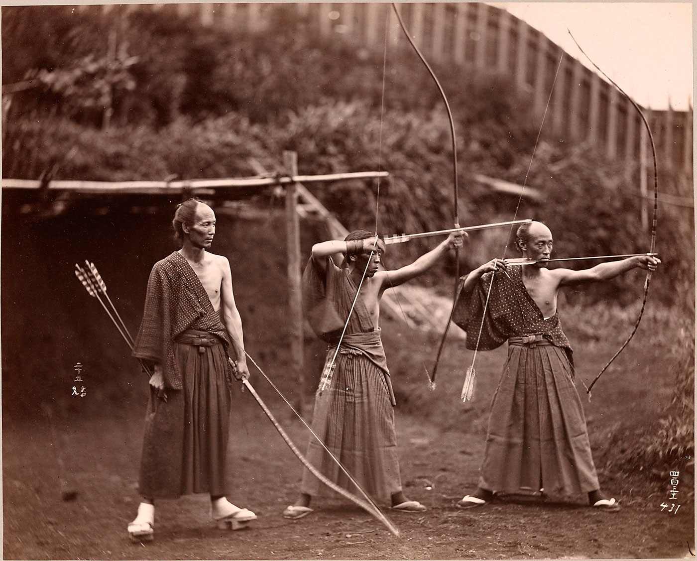

In the 1920s, a German professor named Eugen Herrigel moved to Japan. He came to teach philosophy at a university a few hours northeast of Tokyo, in a city called Sendai.  
在20世纪20年代，一位名叫欧根-赫里格尔的德国教授移居到日本。他来到东京东北部几小时车程的一所大学教哲学，这个城市叫仙台。

To deepen his understanding of Japanese culture, Herrigel began training in Kyudo, the Japanese martial art of archery. He was taught by a legendary archer named Awa Kenzo. Kenzo was convinced that beginners should master the fundamentals of archery before attempting to shoot at a real target, and he took this method to the extreme. For the first four years of his training, Herrigel was only allowed to shoot at a roll of straw just seven feet away.  
为了加深对日本文化的理解，赫里格尔开始训练Kyudo，即日本射箭的武术。他的老师是一位名叫阿波贤三的传奇射手。Kenzo坚信，初学者在尝试射杀真正的目标之前，应该掌握射箭的基本原理，他将这种方法发挥到了极致。在他训练的前四年里，赫里格尔只被允许对着七英尺外的一卷稻草射击。

When Herrigel complained of the incredibly slow pace, his teacher replied “The way to the goal is not to be measured! Of what importance are weeks, months, years?”  
当赫里格尔抱怨速度太慢时，他的老师回答说："通往目标的道路是不需要衡量的！"。周、月、年有什么重要的？

When he was finally permitted to shoot at more distant targets, Herrigel’s performance was dismal. The arrows flew off course and he became more discouraged with each wayward shot. During a particularly humbling session, Herrigel stated that his problem must be poor aim.  
当他终于被允许向更远的目标射击时，赫里格尔的表现令人沮丧。箭偏离了方向，每次射出的箭都让他更加灰心丧气。在一次特别惭愧的训练中，Herrigel说他的问题一定是瞄准不准确。

Kenzo, however, looked at his student and replied that it was not whether one aimed, but how one approached the task that determined the outcome. Frustrated with this reply, Herrigel blurted out, “Then you ought to be able to hit it blindfolded.”  
然而，Kenzo看着他的学生，回答说，决定结果的不是一个人是否瞄准，而是一个人如何对待这项任务。赫里格尔对这个回答感到沮丧，他大声说："那么你应该能够蒙着眼睛打中它。

Kenzo paused for a moment and then said, “Come to see me this evening.”  
Kenzo停顿了一会儿，然后说："今天晚上来见我。"

## Archery in the Dark 黑暗中的射箭

After night had fallen, the two men returned to the courtyard where the practice hall was located. Kenzo walked to his usual shooting location, now with the target hidden in the dark. The archery master proceeded through his normal routine, settled into his firing stance, drew the bow string tight, and released the first arrow into the darkness.  
夜幕降临后，两个人回到了练习场所在的院子。Kenzo走到他通常的射击位置，现在目标隐藏在黑暗中。箭术大师按正常程序进行，摆好射击姿势，拉紧弓弦，向黑暗中放出第一支箭。

Recalling the event later, Herrigel wrote, “I knew from the sound that it had hit the target.”  
后来回忆起这个事件，赫里格尔写道："我从声音中知道它击中了目标。"

Immediately, Kenzo drew a second arrow and again fired into the night.  
随即，Kenzo拔出第二支箭，再次向黑夜中射击。

Herrigel jumped up and ran across the courtyard to inspect the target. In his book, [Zen in the Art of Archery](https://jamesclear.com/book/zen-in-the-art-of-archery "Zen in the Art of Archery by Eugen Herrigel"), he wrote, “When I switched on the light over the target stand, I discovered to my amazement that the first arrow was lodged full in the middle of the black, while the second arrow had splintered the butt of the first and ploughed through the shaft before embedding itself beside it.”  
赫里格尔跳了起来，跑到院子里去检查靶子。他在《射箭艺术中的禅》一书中写道："当我打开靶架上的灯时，我惊奇地发现，第一支箭完全插在黑色的中间，而第二支箭已经劈开了第一支箭的箭托，在嵌入它的旁边之前犁过了箭杆。

Kenzo had hit a double bullseye without being able to see the target.  
Kenzo在看不到目标的情况下击中了两个靶心。

Three Japanese archers circa 1860. Photographer unknown. (Image Source: [Henry and Nancy Rosin Collection of Early Photography of Japan](http://siris-archives.si.edu/ipac20/ipac.jsp?uri=full=3100001~!239439!0 "Three Japanese archers."). Smithsonian Institution.)  
三个日本弓箭手，大约在1860年。摄影者不详。(图片来源: 亨利和南希-罗辛的日本早期摄影集。史密森学会）。

## Everything Is Aiming 一切都是目的

Great archery masters often teach that “everything is aiming.” Where you place your feet, how you hold the bow, the way you breathe during the release of the arrow—it all determines the end result.  
伟大的射箭大师们经常教导说："一切都在瞄准"。你的脚放在哪里，你如何握弓，你在放箭时的呼吸方式--这一切都决定了最终的结果。

In the case of Awa Kenzo, the master archer was so mindful of the process that led to an accurate shot that he was able to replicate the exact series of internal movements even without seeing the external target. This complete awareness of the body and mind in relation to the goal is known as _zanshin_.  
在Awa Kenzo的例子中，这位弓箭手大师非常注意导致准确射击的过程，甚至在没有看到外部目标的情况下，他也能复制一系列准确的内部动作。这种对身体和心灵与目标相关的完全意识被称为 "赞"。

_Zanshin_ is a word used commonly throughout Japanese martial arts to refer to a state of relaxed alertness. Literally translated, _zanshin_ means “the mind with no remainder.” In other words, the mind completely focused on action and fixated on the task at hand. _Zanshin_ is being constantly aware of your body, mind, and surroundings without stressing yourself. It is an effortless vigilance.  
禅心是日本武术中常用的一个词，指的是一种放松的警觉状态。从字面上翻译，赞善的意思是 "心无余力"。换句话说，就是思想完全集中在行动上，固定在手头的任务上。禅心是不断地意识到你的身体、思想和周围环境而不给自己带来压力。它是一种毫不费力的警觉。

In practice, though, _zanshin_ has an even deeper meaning. _Zanshin_ is choosing to live your life intentionally and acting with purpose rather than mindlessly falling victim to whatever comes your way.  
但在实践中，"赞 "有更深的含义。禅心是选择有意识地生活，有目的地行动，而不是无意识地成为你所遇到的任何事情的受害者。

## The Enemy of Improvement 改善的敌人

There is a famous Japanese proverb that says, “After winning the battle, tighten your helmet.”  
日本有一句著名的谚语："在赢得战斗后，要收紧你的头盔"。

In other words, the battle does not end when you win. The battle only ends when you get lazy, when you lose your sense of commitment, and when you stop paying attention. This is _zanshin_ as well: the act of living with alertness regardless of whether the goal has already been achieved.  
换句话说，战斗并不是在你获胜时才结束。只有当你变得懒惰，当你失去承诺感，当你停止关注时，战斗才会结束。这也是赞善：无论目标是否已经实现，都要警觉地生活。

We can carry this philosophy into many areas of life.  
我们可以将这种哲学带入生活的许多领域。

-   **Writing:** The battle does not end when you publish a book. It ends when you consider yourself a finished product, when you lose the vigilance needed to continue improving your craft.  
    写作。当你出版一本书时，战斗并没有结束。当你认为自己是一个成品时，当你失去继续改进你的手艺所需的警惕性时，它就结束了。
-   **Fitness:** The battle does not end when you hit a PR. It ends when you lose concentration and skip workouts or when you lose perspective and overtrain.  
    健身。战斗并不是在你达到PR的时候结束的。当你失去注意力和跳过锻炼时，或者当你失去视角和过度训练时，它就结束了。
-   **Entrepreneurship:** The battle does not end when you make a big sale. It ends when you get cocky and complacent.  
    企业家精神。战斗并不是在你做了一笔大买卖后才结束的。而是在你自大和自满时结束。

The enemy of improvement is neither failure nor success. The enemy of improvement is boredom, fatigue, and lack of concentration. The enemy of improvement is a lack of commitment to the process because the process is everything.  
改进的敌人既不是失败也不是成功。改进的敌人是无聊、疲劳和缺乏专注。改进的敌人是缺乏对过程的承诺，因为过程就是一切。

## The Art of Zanshin in Everday Life  
日常生活中的赞善艺术

_“One should approach all activities and situations with the same sincerity, the same intensity, and the same awareness that one has with bow and arrow in hand.”  
"一个人应该以同样的诚意、同样的强度和同样的意识来对待所有的活动和情况，就像手握弓箭时一样。"_

—Kenneth Kushner, [One Arrow, One Life](https://jamesclear.com/book/one-arrow-one-life "One Arrow, One Life by Kenneth Kushner")  
\-Kenneth Kushner，《一箭双雕》。

We live in a world obsessed with results. Like Herrigel, we have a tendency to put so much emphasis on whether or not the arrow hits the target. If, however, we put that intensity and focus and sincerity into the process—where we place our feet, how we hold the bow, how we breathe during the release of the arrow—then hitting the bullseye is simply a side effect.  
我们生活在一个痴迷于结果的世界。像赫里格尔一样，我们倾向于把重点放在箭是否射中目标上。然而，如果我们把这种强度、注意力和诚意放在过程中--我们把脚放在哪里，我们如何持弓，我们在放箭时如何呼吸--那么击中靶心就只是一个副作用。

The point is not to worry about hitting the target. The point is to [fall in love with the boredom of doing the work](https://jamesclear.com/stay-focused "How to stay focused when you get bored.") and embrace each piece of the process. The point is to take that moment of _zanshin_, that moment of complete awareness and focus, and carry it with you everywhere in life.  
关键是不要担心击中目标。关键是要爱上做工作的无聊感，并拥抱这个过程的每一个部分。关键是要把那一刻的赞美，那一刻的完全意识和专注，带着它在生活中无处不在。

It is not the target that matters. It is not the finish line that matters. It is the way we approach the goal that matters. Everything is aiming. _Zanshin_.  
重要的不是目标。重要的不是终点线。重要的是我们接近目标的方式。一切都是目标。赞成。

## Read Next 阅读下一篇

-   [The Beginner’s Guide to Continuous Self-Improvement  
    不断自我完善的新手指南](https://jamesclear.com/self-improvement)
-   [The Best Self-Help Books  
    最好的自我帮助书籍](https://jamesclear.com/best-books/self-help)
-   [Famous Biologist Louis Agassiz on the Usefulness of Learning Through Observation  
    著名生物学家路易斯-阿加西谈通过观察学习的益处](https://jamesclear.com/louis-agassiz "Famous Biologist Louis Agassiz on the Usefulness of Learning Through Observation")
