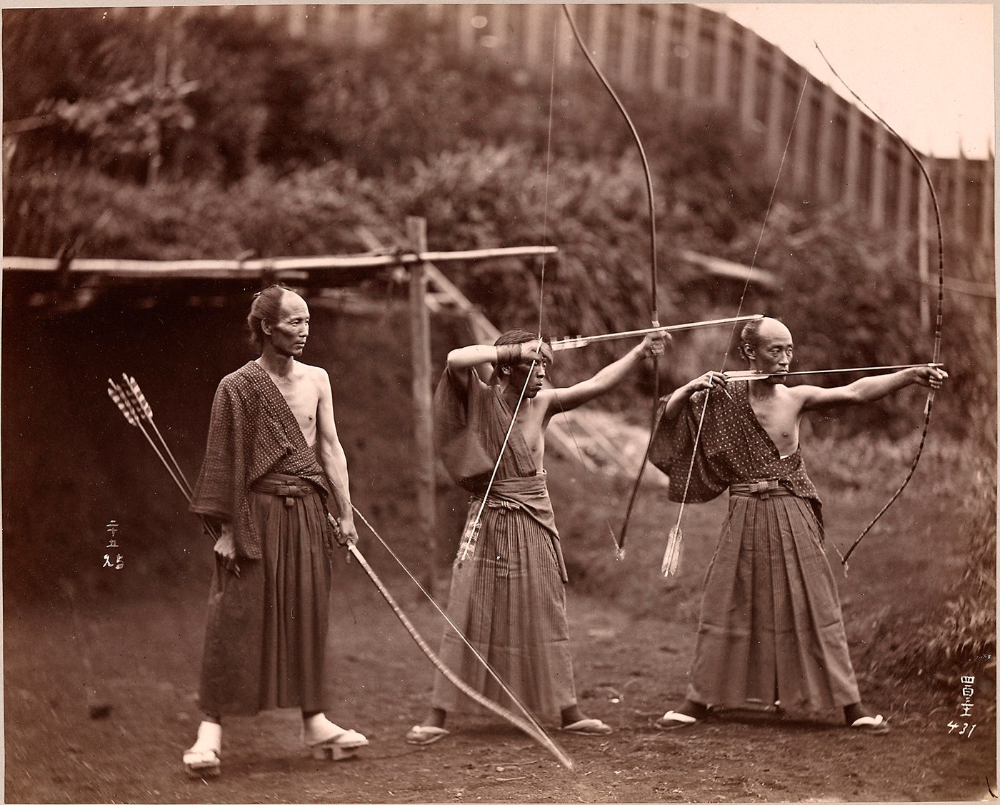

In the 1920s, a German professor named Eugen Herrigel moved to Japan. He came to teach philosophy at a university a few hours northeast of Tokyo, in a city called Sendai.  
20世纪20年代，一位名叫 Eugen Herrigel 的德国教授移居日本。他来到东京东北部一个叫仙台的城市，在一所大学教授哲学，那里离东京只有几个小时的路程。

To deepen his understanding of Japanese culture, Herrigel began training in Kyudo, the Japanese martial art of archery. He was taught by a legendary archer named Awa Kenzo. Kenzo was convinced that beginners should master the fundamentals of archery before attempting to shoot at a real target, and he took this method to the extreme. For the first four years of his training, Herrigel was only allowed to shoot at a roll of straw just seven feet away.  
为了加深对日本文化的了解，赫里格尔开始在 Kyudo 训练日本的射箭武术。他的老师是传说中的弓箭手阿波贤三。贤三确信，初学者应该掌握基本的射箭之前，试图射击一个真正的目标，他采取了这种方法的极端。在头四年的训练中，赫里格尔只被允许射击7英尺外的一卷稻草。

When Herrigel complained of the incredibly slow pace, his teacher replied “The way to the goal is not to be measured! Of what importance are weeks, months, years?”  
当赫里格尔抱怨他的速度太慢时，他的老师回答说: “通往目标的道路是不可衡量的！几周，几个月，几年有什么重要的?”

When he was finally permitted to shoot at more distant targets, Herrigel’s performance was dismal. The arrows flew off course and he became more discouraged with each wayward shot. During a particularly humbling session, Herrigel stated that his problem must be poor aim.  
当他最终被允许射击更远的目标时，赫里格尔的表现令人沮丧。箭偏离了航线，每射一箭，他都更加泄气。在一次特别谦逊的会议上，赫里格尔说他的问题一定是瞄准不准。

Kenzo, however, looked at his student and replied that it was not whether one aimed, but how one approached the task that determined the outcome. Frustrated with this reply, Herrigel blurted out, “Then you ought to be able to hit it blindfolded.”  
然而，贤三看着他的学生，回答说，决定结果的不是一个人是否有目标，而是一个人如何完成任务。赫里格尔对这个回答感到沮丧，脱口而出: “那么你应该可以蒙着眼睛打它。”

Kenzo paused for a moment and then said, “Come to see me this evening.”  
贤三停顿了一会儿，然后说: “今晚来看我吧。”

## Archery in the Dark 黑暗中的箭术

After night had fallen, the two men returned to the courtyard where the practice hall was located. Kenzo walked to his usual shooting location, now with the target hidden in the dark. The archery master proceeded through his normal routine, settled into his firing stance, drew the bow string tight, and released the first arrow into the darkness.  
夜幕降临后，两个人回到了练习厅所在的院子里。贤三走向他惯常的射击位置，现在目标隐藏在黑暗中。射箭大师继续他的正常程序，进入他的射击姿势，拉紧弓弦，并释放了第一支箭进入黑暗。

Recalling the event later, Herrigel wrote, “I knew from the sound that it had hit the target.”  
后来回忆起这件事，Herrigel 写道，“我从声音中知道它击中了目标。”

Immediately, Kenzo drew a second arrow and again fired into the night.  
贤三立刻拔出第二支箭，再次射向黑夜。

Herrigel jumped up and ran across the courtyard to inspect the target. In his book, [Zen in the Art of Archery](https://jamesclear.com/book/zen-in-the-art-of-archery "Zen in the Art of Archery by Eugen Herrigel"), he wrote, “When I switched on the light over the target stand, I discovered to my amazement that the first arrow was lodged full in the middle of the black, while the second arrow had splintered the butt of the first and ploughed through the shaft before embedding itself beside it.”  
赫里格尔跳起来，跑过院子去检查目标。他在《箭术禅》(Zen In the Art of Archery)一书中写道: “当我打开目标支架上的灯时，我惊讶地发现，第一支箭完全卡在了黑色的中间，而第二支箭已经把第一支箭的箭头撕裂，穿过箭杆，然后扎进了它的旁边。”

Kenzo had hit a double bullseye without being able to see the target.  
健三打中了两个靶心，但是没有看到目标。

Three Japanese archers circa 1860. Photographer unknown. (Image Source: [Henry and Nancy Rosin Collection of Early Photography of Japan](http://siris-archives.si.edu/ipac20/ipac.jsp?uri=full=3100001~!239439!0 "Three Japanese archers."). Smithsonian Institution.)  
大约1860年，三名日本弓箭手。摄影师未知。(图片来源: 亨利和南希罗新收集的早期日本摄影。史密森尼学会)

## Everything Is Aiming 万物皆有目标

Great archery masters often teach that “everything is aiming.” Where you place your feet, how you hold the bow, the way you breathe during the release of the arrow—it all determines the end result.  
伟大的射箭大师经常教导人们“一切都是有目的的。”你把脚放在哪里，如何握弓，在射箭的过程中如何呼吸，这些都决定了最终的结果。

In the case of Awa Kenzo, the master archer was so mindful of the process that led to an accurate shot that he was able to replicate the exact series of internal movements even without seeing the external target. This complete awareness of the body and mind in relation to the goal is known as _zanshin_.  
在 Awa Kenzo 的案例中，这位射箭大师非常注意导致精确射击的过程，以至于他能够在没有看到外部目标的情况下复制出精确的一系列内部动作。这种对与目标相关的身体和心灵的完全觉知被称为“赞成”。

_Zanshin_ is a word used commonly throughout Japanese martial arts to refer to a state of relaxed alertness. Literally translated, _zanshin_ means “the mind with no remainder.” In other words, the mind completely focused on action and fixated on the task at hand. _Zanshin_ is being constantly aware of your body, mind, and surroundings without stressing yourself. It is an effortless vigilance.  
日本武术是一个常用的词，指的是一种放松的警觉状态。从字面上翻译，zanshin 的意思是“没有剩余的思想。”换句话说，大脑完全专注于行动，专注于手头的任务。赞成是不断意识到你的身体，思想和环境，而不是强调自己。这是一种不费吹灰之力的警觉。

In practice, though, _zanshin_ has an even deeper meaning. _Zanshin_ is choosing to live your life intentionally and acting with purpose rather than mindlessly falling victim to whatever comes your way.  
然而，在实践中，zanshin 有着更深层的含义。赞成是选择有目的地生活，有目的地行动，而不是盲目地成为任何事情的牺牲品。

## The Enemy of Improvement 改进的敌人

There is a famous Japanese proverb that says, “After winning the battle, tighten your helmet.”  
有一句著名的日语谚语是这样说的，“在赢得战斗后，紧紧你的头盔。”

In other words, the battle does not end when you win. The battle only ends when you get lazy, when you lose your sense of commitment, and when you stop paying attention. This is _zanshin_ as well: the act of living with alertness regardless of whether the goal has already been achieved.  
换句话说，战斗不会因为你的胜利而结束。只有当你变得懒惰，当你失去承诺感，当你不再关注时，这场战斗才会结束。这也是 zanshin: 带着警觉生活的行为，不管目标是否已经实现。

We can carry this philosophy into many areas of life.  
我们可以把这种哲学运用到生活的许多领域。

-   **Writing:** The battle does not end when you publish a book. It ends when you consider yourself a finished product, when you lose the vigilance needed to continue improving your craft.  
    写作: 当你出版一本书的时候，这场战斗并没有结束。当你认为自己是一个成品，当你失去了继续提高工艺所需的警觉时，它就结束了。
-   **Fitness:** The battle does not end when you hit a PR. It ends when you lose concentration and skip workouts or when you lose perspective and overtrain.  
    健身: 当你遇到公关的时候，战斗并没有结束。当你注意力不集中，缺乏锻炼，或者当你失去远见和过度训练时，它就结束了。
-   **Entrepreneurship:** The battle does not end when you make a big sale. It ends when you get cocky and complacent.  
    企业家精神: 当你做成一笔大生意时，这场战斗并没有结束。当你变得骄傲自满时，这场战斗就结束了。

The enemy of improvement is neither failure nor success. The enemy of improvement is boredom, fatigue, and lack of concentration. The enemy of improvement is a lack of commitment to the process because the process is everything.  
进步的敌人既不是失败也不是成功。改进的敌人是无聊、疲劳和注意力不集中。改进的敌人是缺乏对过程的承诺，因为过程就是一切。

## The Art of Zanshin in Everday Life  
日常生活中的 Zanshin 艺术

_“One should approach all activities and situations with the same sincerity, the same intensity, and the same awareness that one has with bow and arrow in hand.”  
“一个人应该以同样的真诚，同样的强度，同样的意识去处理所有的活动和情况，就像一个人手持弓箭一样。”_

—Kenneth Kushner, [One Arrow, One Life](https://jamesclear.com/book/one-arrow-one-life "One Arrow, One Life by Kenneth Kushner")  
肯尼斯 · 库什纳《一箭一命》

We live in a world obsessed with results. Like Herrigel, we have a tendency to put so much emphasis on whether or not the arrow hits the target. If, however, we put that intensity and focus and sincerity into the process—where we place our feet, how we hold the bow, how we breathe during the release of the arrow—then hitting the bullseye is simply a side effect.  
我们生活在一个追求结果的世界。像 Herrigel 一样，我们倾向于过分强调箭是否射中目标。然而，如果我们把这种强烈、专注和真诚放在这个过程中ーー我们把脚放在哪里、我们如何握弓、我们在射箭时如何呼吸ーー那么击中靶心只是一种副作用。

The point is not to worry about hitting the target. The point is to [fall in love with the boredom of doing the work](https://jamesclear.com/stay-focused "How to stay focused when you get bored.") and embrace each piece of the process. The point is to take that moment of _zanshin_, that moment of complete awareness and focus, and carry it with you everywhere in life.  
关键是不用担心击中目标。关键是要爱上无聊的工作，并拥抱过程中的每一个环节。关键是要把这一瞬间的禅心，这一瞬间的完全意识和专注，并带着它在生活中的每一个地方。

It is not the target that matters. It is not the finish line that matters. It is the way we approach the goal that matters. Everything is aiming. _Zanshin_.  
目标并不重要。重要的不是终点线。重要的是我们实现目标的方式。一切都在瞄准。赞欣。

## Read Next

-   [The Beginner’s Guide to Continuous Self-Improvement  
    持续自我提高的初学者指南](https://jamesclear.com/self-improvement)
-   [The Best Self-Help Books  
    最佳自助书籍](https://jamesclear.com/best-books/self-help)
-   [Famous Biologist Louis Agassiz on the Usefulness of Learning Through Observation  
    著名生物学家路易斯 · 阿加西关于通过观察学习的有用性](https://jamesclear.com/louis-agassiz "Famous Biologist Louis Agassiz on the Usefulness of Learning Through Observation")
