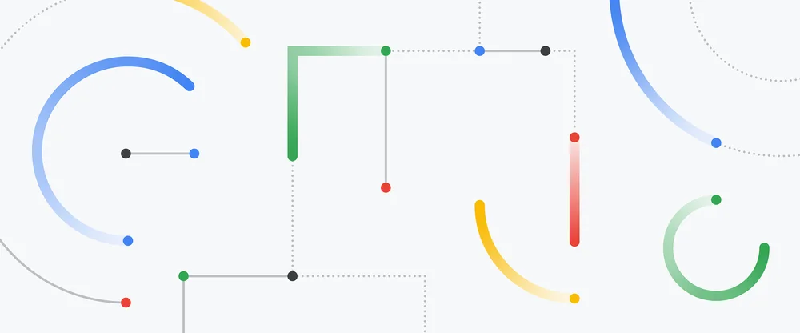
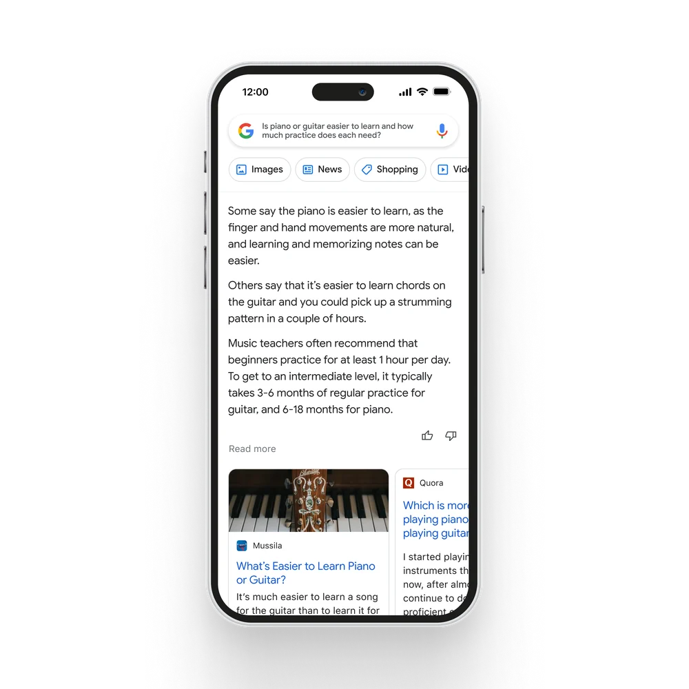

AI is the most profound technology we are working on today. Whether it’s helping doctors detect diseases earlier or enabling people to access information in their own language, AI helps people, businesses and communities unlock their potential. And it opens up new opportunities that could significantly improve billions of lives. That’s why we re-oriented the company around AI six years ago — and why we see it as the most important way we can deliver on our mission: to organize the world’s information and make it universally accessible and useful.  
人工智能是我们今天正在研究的最深奥的技术。无论是帮助医生更早地发现疾病，还是帮助人们用自己的语言获取信息，人工智能都能帮助人们、企业和社区释放他们的潜力。它开辟了新的机会，可以显著改善数十亿人的生活。这就是为什么我们在六年前将公司重新定位于人工智能的原因，也是为什么我们认为它是我们完成使命的最重要方式: 组织全球信息，使其普遍可获取和有用。

Since then we’ve continued to make investments in AI across the board, and Google AI and DeepMind are advancing the state of the art. Today, the scale of the largest AI computations is [doubling every six months](http://arxiv.org/abs/2202.05924), far outpacing Moore’s Law. At the same time, advanced generative AI and large language models are capturing the imaginations of people around the world. In fact, our [Transformer](https://arxiv.org/abs/1706.03762) research project and our field-defining paper in 2017, as well as our important advances in diffusion models, are now the basis of many of the generative AI applications you're starting to see today.  
从那以后，我们继续在人工智能领域进行全方位的投资，谷歌人工智能和 DeepMind 正在推进这项技术的发展。今天，最大的人工智能计算规模每六个月翻一番，远远超过摩尔定律。与此同时，先进的生成式人工智能和大型语言模型正在抓住世界各地人们的想象力。事实上，我们的《变形金刚》研究项目和2017年的领域定义论文，以及我们在扩散模型方面的重要进展，现在是你们今天开始看到的许多创造性人工智能应用的基础。

## Introducing Bard 介绍一下巴德

It’s a really exciting time to be working on these technologies as we translate deep research and breakthroughs into products that truly help people. That’s the journey we’ve been on with large language models. Two years ago we unveiled next-generation language and conversation capabilities powered by our Language Model for Dialogue Applications (or [LaMDA](https://blog.google/technology/ai/lamda/) for short).  
当我们将深入的研究和突破转化为真正能够帮助人们的产品时，从事这些技术的工作真的是一个令人兴奋的时刻。这就是我们使用大型语言模型的过程。两年前，我们发布了由我们的对话应用语言模型(或简称 LaMDA)驱动的下一代语言和会话功能。

We’ve been working on an experimental conversational AI service, powered by LaMDA, that we’re calling Bard. And today, we’re taking another step forward by opening it up to trusted testers ahead of making it more widely available to the public in the coming weeks.  
我们一直在研究一种实验性的对话式人工智能服务，由 LaMDA 提供动力，我们称之为 Bard。今天，我们又向前迈进了一步，向可信赖的测试人员开放，并在未来几周内向公众更广泛地提供它。

Bard seeks to combine the breadth of the world’s knowledge with the power, intelligence and creativity of our large language models. It draws on information from the web to provide fresh, high-quality responses. Bard can be an outlet for creativity, and a launchpad for curiosity, helping you to explain new discoveries from NASA’s James Webb Space Telescope to a 9-year-old, or learn more about the best strikers in football right now, and then get drills to build your skills.  
巴德寻求将世界知识的广度与我们庞大语言模型的力量、智慧和创造力结合起来。它利用来自网络的信息来提供新鲜、高质量的回应。巴德可以成为创造力的发泄口，也可以成为好奇心的发射台，帮助你向一个9岁的孩子解释美国国家航空航天局詹姆斯·韦伯空间望远镜的新发现，或者学习更多关于现在足球界最好的前锋的知识，然后通过训练来提高你的技能。

Video format not supported  不支持视频格式

Use Bard to simplify complex topics, like explaining new discoveries from NASA’s James Webb Space Telescope to a 9-year-old.  
使用巴德来简化复杂的话题，比如向一个9岁的孩子解释美国国家航空航天局詹姆斯·韦伯空间望远镜的新发现。

We’re releasing it initially with our lightweight model version of LaMDA. This much smaller model requires significantly less computing power, enabling us to scale to more users, allowing for more feedback. We’ll combine external feedback with our own internal testing to make sure Bard’s responses meet a [high bar for quality, safety and groundedness](https://ai.googleblog.com/2022/01/lamda-towards-safe-grounded-and-high.html) in real-world information. We’re excited for this phase of testing to help us continue to learn and improve Bard’s quality and speed.  
我们最初发布它与我们的轻量级模型版本的 LaMDA。这个小得多的模型需要的计算能力显著降低，使我们能够扩展到更多的用户，允许更多的反馈。我们将结合外部反馈和我们自己的内部测试，以确保巴德的回应符合一个高标准的质量，安全和基础的现实世界的信息。我们很高兴这个阶段的测试，以帮助我们继续学习和提高巴德的质量和速度。

## Bringing the benefits of AI into our everyday products  
将人工智能的好处带入我们的日常产品

We have a long history of using AI to improve Search for billions of people. BERT, one of our first Transformer models, was revolutionary in understanding the intricacies of human language. Two years ago, we introduced MUM, which is 1,000 times more powerful than BERT and has next-level and multi-lingual understanding of information which can pick out [key moments in videos and provide](https://blog.google/products/search/key-moments-video-search/) critical information, including [crisis support,](https://blog.google/products/search/using-ai-keep-google-search-safe/?_ga=2.98664346.52992333.1675136960-653895777.1637261672) in more languages.  
我们使用人工智能来改善搜索数十亿人口已经有很长的历史了。BERT，我们最早的变压器模型之一，在理解人类语言的复杂性方面是革命性的。两年前，我们推出了 MUM，它比 BERT 强大1000倍，对信息具有更高水平的多语言理解能力，可以在视频中挑选关键时刻，并以更多语言提供关键信息，包括危机支持。

Now, our newest AI technologies — like LaMDA, PaLM, Imagen and MusicLM — are building on this, creating entirely new ways to engage with information, from language and images to video and audio. We’re working to bring these latest AI advancements into our products, starting with Search.  
现在，我们最新的人工智能技术ーー如 LaMDA、 PalM、 Imagen 和 MusicLM ーー正在此基础上发展，创造出从语言、图像到视频和音频等全新的信息处理方式。我们正在努力将这些最新的人工智能技术引入我们的产品，从搜索开始。

One of the most exciting opportunities is how AI can deepen our understanding of information and turn it into useful knowledge more efficiently — making it easier for people to get to the heart of what they’re looking for and get things done. When people think of Google, they often think of turning to us for quick factual answers, like “how many keys does a piano have?” But increasingly, people are turning to Google for deeper insights and understanding — like, “is the piano or guitar easier to learn, and how much practice does each need?” Learning about a topic like this can take a lot of effort to figure out what you really need to know, and people often want to explore a diverse range of opinions or perspectives.  
最令人兴奋的机会之一是人工智能如何能够加深我们对信息的理解，并更有效地将其转化为有用的知识ーー使人们更容易找到他们所寻找的东西的核心，并完成工作。当人们想到谷歌时，他们通常会想到向我们寻求快速的事实答案，比如“一架钢琴有多少个琴键?”但是，人们越来越多地转向谷歌寻求更深层次的见解和理解ーー比如，“钢琴或吉他更容易学吗? 它们各自需要多少练习?”学习这样一个话题需要花费很多精力来弄清楚你真正需要知道的东西，人们通常想要探索各种各样的观点或视角。

AI can be helpful in these moments, synthesizing insights for questions where there’s no one right answer. Soon, you’ll see AI-powered features in Search that distill complex information and multiple perspectives into easy-to-digest formats, so you can quickly understand the big picture and learn more from the web: whether that’s seeking out additional perspectives, like blogs from people who play both piano and guitar, or going deeper on a related topic, like steps to get started as a beginner. These new AI features will begin rolling out on Google Search soon.  
人工智能可以在这些时刻提供帮助，在没有正确答案的问题上综合洞察力。很快，你就会在搜索中看到人工智能驱动的功能，它可以将复杂的信息和多种视角提炼成易于消化的格式，这样你就可以快速了解整体情况，并从网络中学到更多: 无论是寻找额外的视角，比如来自既会弹钢琴又会弹吉他的人的博客，还是在相关主题上进行更深入的研究，比如作为初学者开始的步骤。这些新的人工智能功能将很快在谷歌搜索上推出。

When looking for insights, AI features in Search can distill information to help you see the big picture.  
当寻找见解，人工智能功能在搜索可以提取信息，以帮助您看到大图片。

## Helping developers innovate with AI  
用人工智能帮助开发者创新

Beyond our own products, we think it’s important to make it easy, safe and scalable for others to benefit from these advances by building on top of our best models. Next month, we’ll start onboarding individual developers, creators and enterprises so they can try our Generative Language API, initially powered by LaMDA with a range of models to follow. Over time, we intend to create a suite of tools and APIs that will make it easy for others to build more innovative applications with AI. Having the necessary compute power to build reliable and trustworthy AI systems is also crucial to startups, and we are excited to help scale these efforts through our Google Cloud partnerships with [Cohere](https://cloud.google.com/blog/products/ai-machine-learning/accelerating-language-model-training-with-cohere-and-google-cloud-tpus), [C3.ai](https://c3.ai/partners/googlecloud-partnership/) and [Anthropic](https://www.prnewswire.com/news-releases/anthropic-forges-partnership-with-google-cloud-to-help-deliver-reliable-and-responsible-ai-301738512.html), which was just announced last week. Stay tuned for more developer details soon.  
除了我们自己的产品之外，我们认为通过建立在我们最好的模型之上，让其他人从这些进步中受益，使其变得简单、安全和可扩展是非常重要的。下个月，我们将开始招募个人开发人员、创建人员和企业，这样他们就可以尝试我们的生成语言 API，最初由 LaMDA 提供支持，还有一系列模型可供遵循。随着时间的推移，我们打算创建一套工具和 API，使其他人更容易用 AI 构建更具创新性的应用程序。拥有必要的计算能力来建立可靠和值得信赖的人工智能系统对创业公司来说也是至关重要的，我们很高兴能够通过我们与 Cohere，C3.AI 和 Anthroic 的 Google Cloud 合作伙伴关系来帮助规模化这些努力，这些合作伙伴关系刚刚在上周宣布。请继续关注更多开发人员细节。

## Bold and responsible 大胆而负责任

It’s critical that we bring experiences rooted in these models to the world in a bold and responsible way. That’s why we’re committed to developing AI responsibly: In 2018, Google was one of the first companies to publish a set of [AI Principles](https://ai.google/principles/). We continue to provide education and resources for our researchers, partner with governments and external organizations to develop standards and best practices, and work with communities and experts to make AI safe and useful.  
至关重要的是，我们要以一种大胆和负责任的方式，把植根于这些模式的经验带给世界。这就是我们致力于负责任地开发人工智能的原因: 2018年，谷歌是首批发布一套人工智能原则的公司之一。我们继续为我们的研究人员提供教育和资源，与政府和外部组织合作制定标准和最佳做法，并与社区和专家合作，使人工智能安全和有用。

Whether it’s applying AI to radically transform our own products or making these powerful tools available to others, we’ll continue to be bold with innovation and responsible in our approach. And it’s just the beginning — more to come in all of these areas in the weeks and months ahead.  
无论是应用人工智能从根本上改变我们自己的产品，还是将这些强大的工具提供给其他人，我们都将继续大胆创新，并对我们的方法负责。而且这仅仅是个开始ーー在未来的几周和几个月里，所有这些领域都将迎来更多的挑战。

### About the author  关于作者

#### Sundar Pichai  Sundar Pichai

##### CEO of Google and Alphabet  Google 和 Alphabet 的 CEO

Sundar is the CEO of Google and Alphabet and serves on Alphabet’s Board of Directors. Under his leadership, Google has been focused on developing products and services, powered by the latest advances in AI, that offer help in moments big and small.  
Sundar 是 Google 和 Alphabet 的 CEO，也是 Alphabet 的董事会成员。在他的领导下，谷歌一直致力于开发受人工智能最新进展推动的产品和服务，这些产品和服务在大小事件中都能提供帮助。

[Read more from Sundar  
了解更多 Sundar 的信息](https://blog.google/perspectives/sundar-pichai/)
