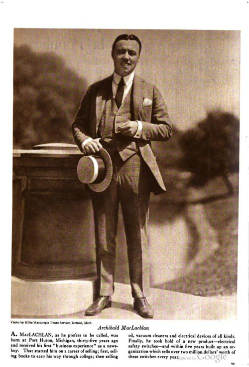
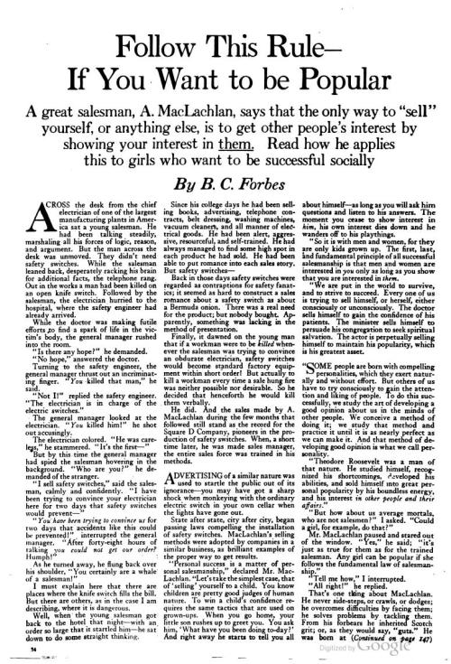
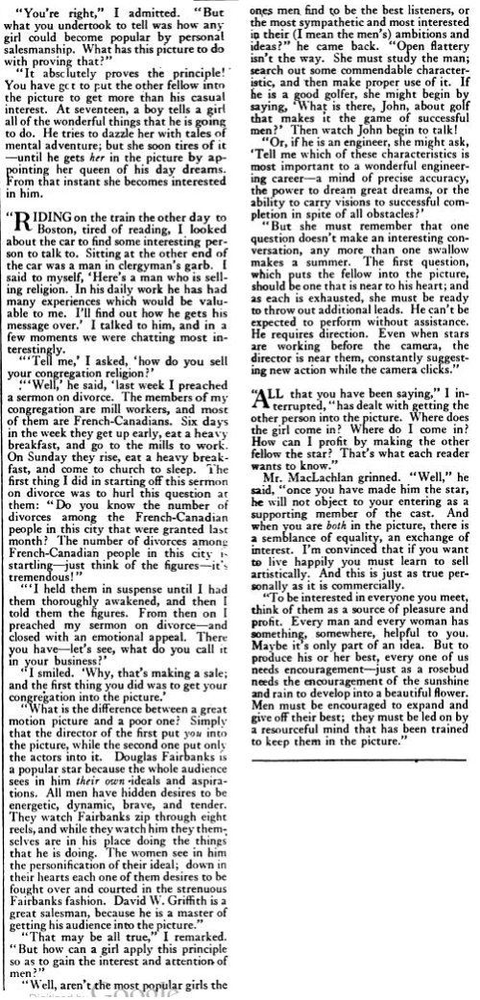

From [a 1922 issue](http://books.google.com/books?id=kstZAAAAYAAJ&vq=maclachlan&dq=%22A%20great%20salesman%2C%20A.%20MacLachlan%22&pg=RA3-PA34#v=onepage&q&f=false) of _The American Magazine,_ something that is just as true today as back then. In fact, it probably has even more importance today, given how things — apps and services — are marketed and sold on the Internet without ever seeing the customers and users in person.  
摘自1922年的《美国杂志》，这句话在今天和当年一样正确。事实上，鉴于事物--应用程序和服务--是如何在互联网上营销和销售的，而从未见过客户和用户本人，它今天可能更加重要。

## Follow This Rule — If You Want to be Popular  
遵循这一规则--如果你想成为受欢迎的人

_A great salesman, A. MacLachlan, says that the only way to “sell” yourself, or anything else, is to get other people’s interest by showing your interest in them. Read how he applies this to girls who want to be successful socially  
一位伟大的推销员A.MacLachlan说，"推销 "自己或其他任何东西的唯一方法是通过展示你对别人的兴趣来获得别人的兴趣。请看他是如何将这一点应用于想要在社交方面取得成功的女孩的。_

by B. C. Forbes 作者：B. C. Forbes

Across the desk from the chief electrician of one of the largest manufacturing plants in America sat a young salesman. He had been talking steadily, marshaling all his forces of logic, reason, and argument. But the man across the desk was unmoved. They didn’t need safety switches. While the salesman leaned back, desperately racking his brain for additional facts, the telephone rang. Out in the works a man had been killed on an open knife switch. Followed by the salesman, the electrician hurried to the hospital, where the safety engineer had already arrived.  
在美国最大的制造厂之一的首席电工的办公桌对面，坐着一位年轻的推销员。他一直在稳定地说话，调动了他所有的逻辑、理性和论证的力量。但桌子对面的人却无动于衷。他们不需要安全开关。正当这位推销员靠在椅背上，拼命地绞尽脑汁寻找更多的事实时，电话响了。在工地上，有一个人被开着的刀开关杀死了。在推销员的追随下，电工匆匆赶往医院，安全工程师已经到达。

While the doctor was making futile efforts to find a spark of life in the victim’s body, the general manager rushed into the room.  
当医生正在进行徒劳的努力以在受害者的身体里找到生命的火花时，总经理冲进了房间。

“Is there any hope?” he demanded.  
"有希望吗？"他问道。

“No hope,” answered the doctor. "没有希望，"医生回答。

Turning to the safety engineer, the general manager thrust out an incriminating finger. _“You_ killed that man,” he said.  
转向安全工程师，总经理伸出了一个有罪的手指。"你杀了那个人，"他说。

“Not I!” replied the safety engineer. “The electrician is in charge of the electric switches.”  
"不是我！"安全工程师回答。"电工负责电闸。"

The general manager looked at the electrician. _“You_ killed him!” he shot out accusingly.  
总经理看着那个电工。"你杀了他！"他指责地拍案而起。

The electrician colored. “He was careless,” he stammered. “It’s the first—”  
电工面露难色。"他很不小心，"他结结巴巴地说。"这是第一次--"

But by this time the general manager had spied the salesman hovering in the background. “Who are you?” he demanded of the stranger.  
但这时总经理已经发现了在后台徘徊的推销员。"你是谁？"他对这个陌生人问道。

“I sell safety switches,” said the salesman, calmly and confidently. “I have been trying to convince your electrician here for two days that safety switches would prevent—”  
"我是卖安全开关的，"推销员平静而自信地说道。"这两天我一直在试图说服你们这里的电工，安全开关可以防止--"

_“You have been trying to convince us_ for two days that accidents like this could be prevented!” interrupted the general manager. “After forty-eight hours of talking _you could not get our order?_ Humph!”  
"你两天来一直试图说服我们，这样的事故是可以避免的！"总经理打断了他的话。"谈了四十八个小时，你们还不能得到我们的订单？哼！"

As he turned away, he flung back over his shoulder, “You certainly are a whale of a salesman!”  
当他转身离开时，他向后甩了甩肩膀："你当然是个鲸鱼般的推销员！"

I must explain here that there are places where the knife switch fills the bill. But there are others, as in the case I am describing, where it is dangerous.  
我必须在此解释，在有些地方，刀子开关能满足要求。但也有一些地方，如我所描述的情况，它是危险的。

Well, when the young salesman got back to the hotel that night — with an order so large that it startled him — he sat down to do some straight thinking.  
好吧，当这位年轻的推销员当晚回到酒店时--带着一份大到让他惊愕的订单--他坐下来做了一些直接的思考。

Since his college days he had been selling books, advertising, telephone contracts, belt dressing, washing machines, vacuum cleaners, and all manner of electrical goods. He had been alert, aggressive, resourceful, and self-trained. He had always managed to find some high spot in each product he had sold. He had been able to put romance into each sales story. But safety switches –  
从他的大学时代起，他就开始销售书籍、广告、电话合同、带状物、洗衣机、吸尘器和各种电器产品。他一直很警觉，积极进取，足智多谋，而且自我训练有素。他总是设法在他销售的每件产品中找到一些亮点。他能够在每个销售故事中加入浪漫的内容。但安全开关

Back in those days safety switches were regarded as contraptions for safety fanatics; it seemed as hard to construct a sales romance about a safety switch as about a Bermuda onion. There was a real need for the product; but nobody bought. Apparently, something was lacking in the method of presentation.  
在那些日子里，安全开关被认为是安全狂热者的玩意儿；似乎就像百慕大洋葱一样，很难构建一个关于安全开关的销售浪漫故事。对该产品有真正的需求；但没有人买。显然，在介绍方法上有些欠缺。

Finally, it dawned on the young man that if a workman were to be _killed_ whenever the salesman was trying to convince an obdurate electrician, safety switches would become standard factory equipment within short order! But actually to kill a workman every time a sale hung fire was neither possible nor desirable. So he decided that henceforth he would kill them verbally.  
最后，这个年轻人恍然大悟，如果每当销售员试图说服一个顽固的电工时，就有一个工人被杀，那么安全开关将在短期内成为工厂的标准设备！但是，实际上，每当销售挂起火来时，就有一个工人被杀，这既不可能也不可能。但实际上，每次销售时都要杀死一个工人，这既不可能也不可取。所以他决定，从今以后，他将在口头上杀死他们。

He did. And the sales made by A. MacLachlan during the few months that followed still stand as the record for the Square D Company, pioneers in the production of safety switches. When, a short time later, he was made sales manager, the entire sales force was trained in his methods.  
他做到了。在随后的几个月里，A. MacLachlan的销售业绩仍然是Square D公司的记录，该公司是生产安全开关的先驱。不久之后，他被任命为销售经理，整个销售队伍都接受了他的方法培训。

Advertising of a similar nature was used to startle the public out of its ignorance — you may have got a sharp shock when monkeying with the ordinary electric switch in your own cellar when the lights have gone out.  
类似性质的广告被用来把公众从无知中惊醒--当你在自己的地窖里玩弄普通的电开关时，你可能会受到剧烈的震动，因为灯已经熄灭了。

State after state, city after city, began passing laws compelling the installation of safety switches. MacLachlan’s selling methods were adopted by companies in a similar business, as brilliant examples of the proper way to get results.  
一个又一个州，一个又一个城市，开始通过法律强制安装安全开关。MacLachlan的销售方法被从事类似业务的公司采用，作为取得成果的正确方法的杰出范例。

“Personal success is a matter of personal salesmanship,” declared Mr. MacLachlan. “Let’s take the simplest case, that of ‘selling’ yourself to a child. You know children are pretty good judges of human nature. To win a child’s confidence requires the same tactics that are used on grown-ups. When you go home, your little son rushes up to greet you. You ask him, ‘What have you been doing to-day?’ And right away he starts to tell you all about himself — as long as you will ask him questions and listen to his answers. The moment you cease to show interest in him, his own interest dies down and he wanders off to his playthings.  
"个人的成功是一个个人销售技巧的问题，"麦克拉伦先生宣称。"让我们举一个最简单的例子，就是向孩子'推销'自己。你知道孩子对人性的判断力很强。要想赢得孩子的信任，就需要采取对成年人使用的同样的策略。当你回家时，你的小儿子急忙跑来迎接你。你问他："你今天做了什么？他马上就开始告诉你关于他的一切--只要你愿意问他问题并听他回答。一旦你不再对他表示兴趣，他自己的兴趣就会消失，他就会走到他的玩物前。

“So it is with men and women, for they are only kids grown up. The first, last, and fundamental principle of all successful salesmanship is that men and women are interested in you only as long as you show that you are interested in _them._  
"男人和女人也是如此，因为他们只是长大了的孩子。所有成功的销售技巧的第一条、最后一条和基本原则是，只有当你表现出对他们感兴趣时，男人和女人才会对你感兴趣。

“We are put in the world to survive, and to strive to succeed. Every one of us is trying to sell himself, or herself, either consciously or unconsciously. The doctor sells himself to gain the confidence of his patients. The minister sells himself to persuade his congregation to seek spiritual salvation. The actor is perpetually selling himself to maintain his popularity, which is his greatest asset.  
"我们被放在这个世界上是为了生存，也是为了争取成功。我们每个人都在有意识或无意识地试图推销自己，或自己。医生推销自己以获得病人的信任。牧师为了说服他的会众寻求精神救赎而推销自己。演员一直在推销自己，以保持他的知名度，这是他最大的财富。

“Some people are born with compelling personalities, which they exert naturally and without effort. But others of us have to try consciously to gain the attention and liking of people. To do this successfully, we study the art of developing a good opinion about us in the minds of other people. We conceive a method of doing it; we study that method and practice it until it is as nearly perfect as we can make it. And that method of developing good opinion is what we call personality.  
"有些人天生就有令人信服的个性，他们不费吹灰之力就能自然地发挥这种个性。但我们中的其他人必须有意识地努力获得人们的关注和喜欢。为了成功地做到这一点，我们要研究在其他人心中对我们产生好感的艺术。我们构思出一种方法；我们研究这种方法并加以实践，直到它达到我们所能做到的最完美的程度。而这种培养好感度的方法就是我们所说的人格。

“Theodore Roosevelt was a man of that nature. He studied himself, recognized his shortcomings, developed his abilities, and sold himself into great personal popularity by his boundless energy, and his interest _in other people and their affairs.”_  
"西奥多-罗斯福是一个具有这种性质的人。他研究自己，认识到自己的缺点，发展自己的能力，并通过他无限的精力和对其他人及其事务的兴趣，把自己卖到了巨大的个人知名度"。

“But how about us average mortals, who are not salesmen?” I asked. “Could a girl, for example, do that?”  
"但我们这些不是推销员的普通凡人呢？"我问道。"比如说，一个女孩能不能做到这一点？"

Mr. MacLachlan paused and stared out of the window. “Yes,” he said; “it’s just as true for them as for the trained salesman. Any girl can be popular if she follows the fundamental law of salesmanship.”  
麦克拉伦先生停了一下，盯着窗外。"是的，"他说；"对她们来说，这和训练有素的推销员一样正确。任何女孩都可以受欢迎，只要她遵循销售技巧的基本规律。"

‘Tell me how,” I interrupted. '告诉我怎么做，"我打断道。

“All right!” he replied. "好的！"他回答。

That’s one thing about MacLachlan. He never side-steps, or crawls, or dodges; he overcomes difficulties by facing them; he solves problems by tackling them. From his forbears he inherited Scotch grit; or, as they would say, “guts.” He was born at Port Huron, Michigan, thirty-five years ago, early became a newsboy, thirsted for a college education, and earned it himself (at the University of Michigan) chiefly by selling books.  
这就是麦克拉伦的一个特点。他从不侧身，或爬行，或躲避；他通过面对困难来克服困难；他通过处理问题来解决问题。他从他的祖先那里继承了苏格兰人的勇气；或者，正如他们所说的，"胆量"。三十五年前，他出生在密歇根州休伦港，早年成为一名报童，渴望接受大学教育，并主要通过卖书来获得教育（在密歇根大学）。

He knew what he wanted to do. He wanted to sell things. So, when he stepped off a train in Minneapolis, with only sixty cents in his pocket, to try to sell oil on a commission basis for a New York concern, he refused to quit when he had a tempting offer to do something else. For six long, hungry, hustling days he lived on that sixty cents, working eleven hours a day, walking from one factory to another, eating nothing but doughnuts and coffee. It was tough going. Then he was offered a job as night clerk in a hotel, at thirty-five dollars a month, a good bed, and meals. Though hungry and tired, he didn’t accept. He stuck to his big idea of selling. If part of the price was going hungry for a while, all right, he would pay the price. He did pay it; and before long he made a real selling record.  
他知道他想做什么。他想卖东西。因此，当他在明尼阿波利斯下了火车，口袋里只有60美分，试图为纽约的一家公司以佣金方式销售石油时，当他有一个诱人的机会做其他事情时，他拒绝辞职。在漫长的、饥饿的、喧嚣的六天里，他靠这六毛钱生活，每天工作11个小时，从一个工厂走到另一个工厂，除了甜甜圈和咖啡什么都不吃。这是个艰难的过程。后来，有人给他提供了一份工作，在一家酒店当夜班服务员，每月35美元，有一张好床，还有饭吃。虽然又饿又累，但他并没有接受。他坚持他的销售的大想法。如果部分代价是饿上一阵子，好吧，他会付出代价的。他确实付了钱；不久，他就创造了一个真正的销售记录。

He has developed, too, a personality that attracts. He follows his own prescription. Although radiant with energy and vision, he keeps his feet on the ground. He is very human.  
他也形成了一种吸引人的个性。他遵循自己的处方。尽管他精力充沛，目光远大，但他还是脚踏实地。他是非常人性化的。

“Let’s begin at fundamentals,” Mr. MacLachlan started, in answer to my challenge that he tell how any girl can make herself popular. “All of us are essentially egotists. We think more about ourselves than about almost anybody or anything else. This doesn’t mean that we think more _of_ ourselves. You may think more of your children than you do of yourself. But the greater part of your thoughts and personal attention concerns not them but you.  
"让我们从根本上开始，"麦克拉伦先生开始回答我的挑战，即他告诉任何女孩如何使自己受欢迎。"我们所有人本质上都是利己主义者。我们对自己的考虑多于对几乎任何人或任何事的考虑。这并不意味着我们更多地考虑自己。你可能比你自己更多地考虑你的孩子。但你的想法和个人关注的大部分不是他们，而是你。

“The common fault is that most of us, thinking in this manner about ourselves so intensely, allow our conversation to center about ourselves most frequently. This doesn’t mean that the average man goes about praising himself or his ability. It merely means that he talks about himself, his personal likes and dislikes, his affections, and so forth.  
"共同的错误是，我们中的大多数人，以这种方式如此强烈地思考自己，让我们的谈话最频繁地以自己为中心。这并不意味着普通人会去赞美自己或自己的能力。这仅仅意味着他谈论自己，谈论他个人的喜好和厌恶，谈论他的情感，等等。

“Now, isn’t it silly of me to sit and talk to another man about myself when he is across the table thinking about himself? All of us do this — except trained salesmen. The conversation of trained salesmen is based on the other man’s thoughts — the other man himself. Of course, his thoughts go further; but that is the fundamental principle of selling — and if anyone wants a serene, happy life, following that principle is the easiest and surest way to obtain it.”  
"现在，当另一个人在桌子对面思考自己的时候，我坐在那里和他谈论自己，这不是很愚蠢吗？我们所有人都会这样做--除了受过训练的推销员。受过训练的推销员的谈话是基于另一个人的想法--另一个人自己。当然，他的想法更进一步；但这是销售的基本原则--如果有人想要一个宁静、快乐的生活，遵循这一原则是获得这种生活最简单、最可靠的方法。"

He suddenly stopped and tossed over to me the photograph of a banquet at which we both had spoken. “Some nice-looking fellows in that picture, aren’t there?” he said, while I examined it.  
他突然停了下来，把我们俩都说过话的一张宴会照片扔给了我。他说："照片上的人长得很好看，不是吗？"我看了看，他说。

I nodded. 我点了点头。

“I’ll bet you a golf ball,” he continued, “the first person you looked for in that picture was yourself! Honest, now, didn’t you?”  
"我跟你赌一个高尔夫球，"他继续说，"你在那张照片上找的第一个人是你自己！"。诚实的，现在，你没有吗？"

“You’re right,” I admitted. “But what you undertook to tell was how any girl could become popular by personal salesmanship. What has this picture to do with proving that?”  
"你是对的，"我承认。"但你承诺要讲的是，任何女孩都可以通过个人的销售技巧变得受欢迎。这张照片与证明这一点有什么关系？"

“It absolutely proves the principle! You have got to put the other fellow into the picture to get more than his casual interest. At seventeen, a boy tells a girl all of the wonderful things that he is going to do. He tries to dazzle her with tales of mental adventure; but she soon tires of it — until he gets _her_ in the picture by appointing her queen of his day dreams. From that instant she becomes interested in him.  
"这绝对证明了这一原则！你必须把另一个人放入画面中，以获得更多的兴趣。你必须把另一个人放在画面中，以获得比他更多的兴趣。17岁时，一个男孩告诉一个女孩他要做的所有美妙的事情。他试图用精神冒险的故事让她眼花缭乱；但她很快就厌倦了--直到他通过任命她为他的白日梦的女王来让她参与其中。从那一刻起，她开始对他感兴趣了。

“Riding on the train the other day to Boston, tired of reading, I looked about the car to find some interesting person to talk to. Sitting at the other end of the car was a man in clergyman’s garb. I said to myself, ‘Here’s a man who is selling religion. In his daily work he has had many experiences which would be valuable to me. I’ll find out how he gets his message over.’ I talked to him, and in a few moments we were chatting most interestingly.  
"有一天在去波士顿的火车上，读累了，我在车厢里四处张望，想找一些有趣的人聊天。坐在车厢另一端的是一个身穿牧师服装的人。我对自己说：'这是个正在推销宗教的人。在他的日常工作中，他有许多经验，对我来说很有价值。我要弄清楚他是如何把信息传递出去的'。我和他聊了起来，不一会儿，我们就聊得非常有趣。

“‘Tell me,’ I asked, ‘how do you sell your congregation religion?’  
"'告诉我，'我问，'你是如何推销你的会众宗教的？

“‘Well,’ he said, ‘last week I preached a sermon on divorce. The members of my congregation are mill workers, and most of them are French-Canadians. Six days in the week they get up early, eat a heavy breakfast, and go to the mills to work. On Sunday they rise, eat a heavy breakfast, and come to church to sleep. The first thing I did in starting off this sermon on divorce was to hurl this question at them: “Do you know the number of divorces among the French-Canadian people in this city that were granted last month? The number of divorces among French-Canadian people in this city is startling — just think of the figures — it’s tremendous!”  
"'好吧，'他说，'上周我讲了一篇关于离婚的讲道。我的会众是工厂的工人，他们中的大多数是法裔加拿大人。每周有六天，他们早早起床，吃一顿丰盛的早餐，然后去工厂工作。星期天，他们起床，吃一顿丰盛的早餐，然后来到教堂睡觉。在开始这篇关于离婚的布道时，我做的第一件事就是向他们抛出这个问题。"你知道上个月这个城市的法裔加拿大人中有多少人离婚了吗？本市法裔加拿大人的离婚数量令人吃惊--只要想想这些数字--就会发现它是巨大的！"

“‘I held them in suspense until I had them thoroughly awakened, and then I told them the figures. From then on I preached my sermon on divorce — and closed with an emotional appeal. There you have — let’s see, what do you call it in your business?’  
"'我让他们悬而未决，直到我把他们彻底唤醒，然后我告诉他们这些数字。从那时起，我就开始了关于离婚的布道--并以情感呼吁结束。你有了--让我看看，你在你的生意中怎么称呼它？

“I smiled. ‘Why, that’s making a sale; and the first thing you did was to get your congregation into the picture.’  
"我笑了笑。'为什么，这就是在做买卖；而你做的第一件事就是让你的会众参与进来。

“What is the difference between a great motion picture and a poor one? Simply that the director of the first put _you_ into the picture, while the second one put only the actors into it. Douglas Fairbanks is a popular star because the whole audience sees in him _their own_ ideals and aspirations. All men have hidden desires to be energetic, dynamic, brave, and tender. They watch Fairbanks zip through eight reels, and while they watch him they themselves are in his place doing the things that he is doing. The women see in him the personification of their ideal; down in their hearts each one of them desires to be fought over and courted in the strenuous Fairbanks fashion. David W. Griffith is a great salesman, because he is a master of getting his audience into the picture.”  
"一部伟大的电影和一部糟糕的电影之间有什么区别？很简单，第一部电影的导演把你放到了电影里，而第二部电影只把演员放到了电影里。道格拉斯-费尔班克斯是一个受欢迎的明星，因为全体观众在他身上看到了自己的理想和愿望。所有的人都有隐秘的愿望，希望成为精力充沛、充满活力、勇敢和温柔的人。他们看着费尔班克斯在八个卷轴上飞驰，当他们看着他时，他们自己也在他的位置上做着他正在做的事情。女人们在他身上看到了她们理想的化身；在她们的内心深处，她们每个人都渴望以费尔班克斯的方式被争夺和追求。大卫-W-格里菲斯是一个伟大的推销员，因为他是一个让观众进入画面的大师。

“That may be all true,” I remarked. “But how can a girl apply this principle so as to gain the interest and attention-of men?”  
"这可能都是真的，"我说。"但一个女孩如何运用这一原则来获得男人的兴趣和关注呢？"

“Well, aren’t the most popular girls the ones men find to be the best listeners, or the most sympathetic and most interested in their (I mean the men’s) ambitions and ideas?” he came back. “Open flattery isn’t the way. She must study the man; search out some commendable characteristic, and then make proper use of it. If he is a good golfer, she might begin by saying, ‘What is there, John, about golf that makes it the game of successful men?’ Then watch John begin to talk!  
"好吧，最受欢迎的女孩不就是那些男人觉得最好的听众，或者最富有同情心，对他们（我是说男人）的野心和想法最感兴趣的女孩吗？"他回来了。"公开奉承不是办法。她必须研究这个人；找出一些值得称赞的特点，然后适当地利用它。如果他是一个好的高尔夫球手，她可以先说：'约翰，高尔夫球有什么特点，使它成为成功人士的游戏？然后看着约翰开始说话!

“Or, if he is an engineer, she might ask, ‘Tell me which of these characteristics is most important to a wonderful engineering career — a mind of precise accuracy, the power to dream great dreams, or the ability to carry visions to successful completion in spite of all obstacles?’  
"或者，如果他是一名工程师，她可能会问：'告诉我，这些特征中哪一个对精彩的工程事业最重要--精确的头脑，梦想伟大的力量，或者不顾一切障碍将愿景成功完成的能力？

“But she must remember that one question doesn’t make an interesting conversation, any more than one swallow makes a summer. The first question, which puts the fellow into the picture, should be one that is near to his heart; and as each is exhausted, she must be ready to throw out additional leads. He can’t be expected to perform without assistance. He requires direction. Even when stars are working before the camera, the director is near them, constantly suggesting new action while the camera clicks.”  
"但她必须记住，一个问题并不能构成一次有趣的谈话，就像一个燕子不能构成一个夏天一样。第一个问题，也就是让对方进入状态的问题，应该是一个接近他内心的问题；当每个问题都用完后，她必须准备好抛出其他的线索。不能指望他在没有帮助的情况下完成任务。他需要指导。甚至当明星们在镜头前工作时，导演也在他们身边，不断地建议新的行动，同时镜头也在咔咔作响。

“All that you have been saying,” I interrupted, “has dealt with getting the other person into the picture. Where does the girl come in? Where do I come in? How can I profit by making the other fellow the star? That’s what each reader wants to know.”  
"你所说的一切，"我打断了他的话，"都是为了让另一个人进入画面。那个女孩在哪里？我在哪里参与？我怎样才能通过让另一个人成为明星而获利？这就是每个读者想知道的。"

Mr. MacLachlan grinned. “Well,” he said, “once you have made him the star, he will not object to your entering as a supporting member of the cast. And when you are _both_ in the picture, there is a semblance of equality, an exchange of interest. I’m convinced that if you want to live happily you must learn to sell artistically. And this is just as true personally as it is commercially.  
麦克拉伦先生咧嘴笑了。"好吧，"他说，"一旦你让他成为明星，他就不会反对你以配角的身份进入剧组。而当你们俩都在戏里时，就会有一种平等的感觉，一种利益的交换。我相信，如果你想快乐地生活，你必须学会艺术地销售。这在个人方面和在商业方面都是一样的。

“To be interested in everyone you meet, think of them as a source of pleasure and profit. Every man and every woman has something, somewhere, helpful to you. Maybe it s only part of an idea. But to produce his or her best, every one of us needs encouragement — just as a rosebud needs the encouragement of the sunshine and rain to develop into a beautiful flower. Men must be encouraged to expand and give off their best; they must be led on by a resourceful mind that has been trained to keep them in the picture.”  
"要对你遇到的每个人感兴趣，把他们当成快乐和利益的来源。每个男人和每个女人都有一些东西，在某个地方，对你有帮助。也许这只是一个想法的一部分。但是，为了产生他或她最好的东西，我们每个人都需要鼓励--就像玫瑰花蕾需要阳光和雨水的鼓励才能发展成美丽的花朵。人必须受到鼓励，以扩大和发出他们最好的东西；他们必须被一个经过训练的足智多谋的头脑所引导，使他们保持在画面中。"

## \* \* \* \* \* \*

Original page images (third image a composite of two partial pages), click to enlarge:  
原始页面图片（第三张图片是两张部分页面的合成），点击放大。

### Share this: 分享这一点。

### Like this: 像这样。

One blogger likes this. 一位博主喜欢这个。

-   

This information was automatically retrieved on 2012-12-27T18:22:59+00:00 from:  
该信息于2012-12-27T18:22:59+00:00自动检索，来自。

and automatically parsed, clean up and interpreted by [dotEPUB.com](http://dotepub.com/?lang=en). It is distributed on an “AS IS” BASIS, WITHOUT WARRANTIES OR CONDITIONS OF ANY KIND, either express or implied. This e-book is not an authoritative source: please, visit the [original webpage](http://mikecanex.wordpress.com/2012/12/26/1922-follow-this-rule-if-you-want-to-be-popular/).  
并由dotEPUB.com自动解析、清理和解释。它是在 "原样 "的基础上分发的，没有任何形式的保证或条件，无论是明示还是暗示。这本电子书不是一个权威的来源：请访问原始网页。

dotEPUB’s cleanup process is partially based on a modified old version of [Readability](https://www.readability.com/) (© by arc90).  
dotEPUB的清理过程部分是基于Readability（©由arc90）的一个修改过的旧版本。

(v. 0.8.1) (v. 0.8.1)
