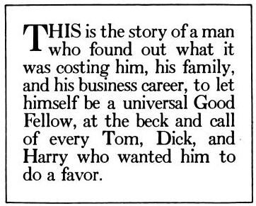
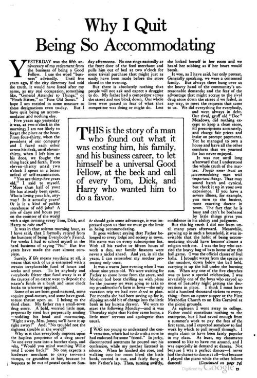
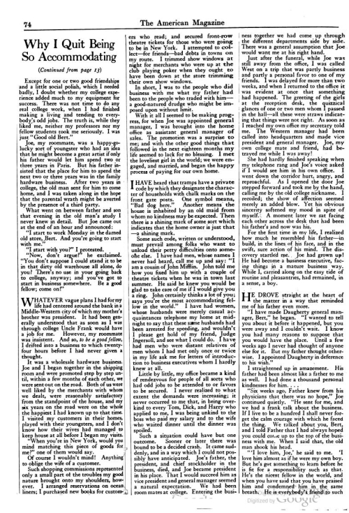
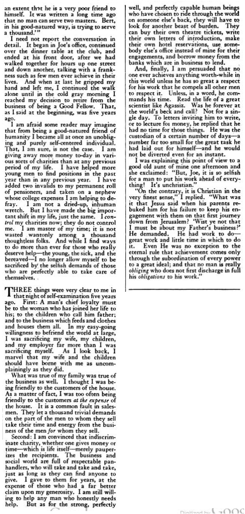

_**Update:**_ See [this post](https://mikecanex.wordpress.com/2012/12/27/an-experiment-in-epub-ebooks/) for a free ePub eBook version of this long post.  
更新：请看这篇文章，了解这篇长文的免费ePub电子书版本。

A very odd essay from [a 1922 issue](http://books.google.com/books?id=kstZAAAAYAAJ&pg=RA3-PA13#v=onepage&q&f=false) of _The American Magazine_ that seems to go against the general grain of most of the articles published then. There is also no name attached to it.  
一篇来自1922年的《美国杂志》的非常奇怪的文章，似乎与当时发表的大多数文章的一般规律相悖。这篇文章也没有附上名字。

**Why I Quit Being So Accommodating  
为什么我不再那么迁就**

Yesterday was the fifth anniversary of my retirement from the business of being a Good Fellow. I use the word “business” advisedly. Until five years ago, if the city directory had told the truth, it would have listed after my name, as my real occupation, something like, “General Attender to Things,” or “Pinch Hitter,” or “Fine Old Scout.” I hope I am entitled in some measure to these designations even to-day. But I have quit being an accommodator and nothing else.  
昨天是我从 "好伙伴 "事业中退休的五周年。我谨慎地使用 "业务 "这个词。直到五年前，如果城市目录说的是真话，它就会在我的名字后面列出我的真正职业，比如说："事情的一般处理者"，或 "夹击者"，或 "优秀的老侦察员"。我希望，即使在今天，我在某种程度上也有资格获得这些称号。但是，我已经不再是一个迁就者，而不是其他。

Five years ago yesterday it was, at two o’clock in the morning; I am not likely to forget the place or the hour. From four-thirty, when the president of our company and I faced each other across his desk, until eleven-thirty, when I left him at his door, we fought the thing back and forth. From eleven-thirty until two o’clock I spent in a bitter ordeal of self-examination.  
五年前的昨天，那是在凌晨两点；我不可能忘记那个地点和时间。从四点半，我们公司的总裁和我在他的办公桌前面对面，直到十一点半，我在他的门口离开他，我们来回地争论这件事。从十一点半到两点，我在痛苦的自我反省中度过。

“You are thirty-five years old,” I said to myself. “More than half of your life has already been spent. Who is living your life, anyway? Is it actually _yours?_ Or is it a kind of public storehouse of odd jobs? A pile of days and hours put on the counter of the world with a sign inviting every Tom, Dick, and Harry to _take one?”_  
"你已经三十五岁了，"我对自己说。"你的生命已经过了一半以上。到底是谁在过你的生活？它实际上是你的吗？还是说它是一种打杂的公共仓库？一堆日子和时间放在世界的柜台上，挂着一个牌子，邀请每一个汤姆、迪克和哈里去做一件？"

It was in that solemn morning hour, as I have said, that I formally retired from the business of being Everybody’s Friend. For weeks I had to school myself in the hard business of saying “No.” But five years have made the cure almost complete.  
就在那个庄严的早晨，正如我所说的，我正式退出了成为大家的朋友的事业。几个星期以来，我不得不让自己学习说 "不 "的艰难事业。但五年来，我几乎完成了治愈。

Surely, if life means anything at all, it means that each of us is entrusted with a certain irreplaceable fund of hours and weeks and years. To let anybody and everybody fritter that fund away is as if the trustee of an estate were to deposit the estate’s funds in a bank and issue check books to whoever applied.  
当然，如果生命有任何意义，它意味着我们每个人都被赋予了某种不可替代的小时、周和年的资金。让任何人和每个人浪费这笔资金，就好像遗产的受托人将遗产的资金存入银行，并向任何申请者发放支票簿。

Some of us are born good-natured, some acquire good-nature, and some have good-nature thrust upon us. I belong to the third class. My father ran a small-town drug store. A bald, worried little man, perpetually tired but perpetually smiling — nodding his head and murmuring, “Right away, Mrs. Jones; we’ll have it up right away!’ And, “No trouble! not the slightest trouble in the world!”  
我们中有些人天生善良，有些人获得了善良，有些人是被强加给我们的善良。我属于第三类。我的父亲经营一家小镇上的药店。一个秃头的、忧心忡忡的小个子男人，永远疲惫不堪，但永远面带微笑--点头哈腰，喃喃自语："马上，琼斯太太；我们马上就能弄好！'还有，"没有麻烦！世界上没有丝毫的麻烦！"

Why is it that everybody imposes upon the hapless proprietor of a drug store? No one ever runs into a butcher shop, and asks, “Would you mind watching Willie until I come back?” No one, expects a hardware merchant to carry two-cent stamps, or grumbles at him, because he happens to be out of postal cards on Sunday afternoons. No one rings excitedly at the front door of the feed merchant and pulls him out of bed at two o’clock for some trivial purchase that might just as easily have been made before the store closed in the evening.  
为什么每个人都要强加给无助的药店老板？从来没有人跑到肉店里问："你能不能帮我看着威利，等我回来？"没有人期望一个五金商贩能卖两分钱的邮票，也没有人因为他在星期天下午刚好没有邮票而对他发牢骚。没有人兴奋地敲响饲料商的大门，在两点钟把他从床上拉起来，因为他要买一些微不足道的东西，而这些东西在晚上商店关门前就可以轻易买到。

But there is absolutely nothing that people will not ask and expect a druggist to do. My father had a competitor across the street and one block down. Our whole lives were passed in fear of what that competitor was doing or might do. Lest _he_ should gain some advantage, it was impressed upon us that we must go the limit in being accommodating.  
但是，人们绝对不会要求和期望一个药商做什么。我父亲在街对面和下一个街区有一个竞争对手。我们的整个生活都是在恐惧中度过的，担心那个竞争者正在做或可能做什么。为了避免他获得一些好处，我们都知道我们必须尽力迁就。

It goes without saying that Father belonged to every lodge and society in town. His name was on every subscription list. With all his twelve or fifteen hours of work a day, our family finances were never a nickel ahead. And yet, in all the years, I can remember my mother protesting only once.  
不言而喻，父亲属于城里的每一个俱乐部和社团。他的名字出现在每一份订阅名单上。他每天工作十二或十五个小时，我们家的经济状况从来没有好过一分钱。然而，这么多年来，我记得我母亲只抗议过一次。

It was a warm June evening when I was about nine years old. We were waiting for Father to come home from the store, and Mother had been thrilling us with plans for the journey we were going to take to my grandmother’s farm in Iowa — the only vacation trip we had ever _dared_ to plan. For months she had been saving up for it, slipping an odd bit of change into the little bank in her bureau drawer. We were to start the following Monday — and it was Thursday night that Father came home, a little more nervous and apologetic than usual.  
那是一个温暖的六月夜晚，我大约九岁。我们在等父亲从商店回家，母亲一直在为我们计划去爱荷华州的祖母的农场旅行而激动不已--这是我们唯一敢于计划的假期旅行。几个月来，她一直在为这次旅行攒钱，把一点一滴的零钱塞进她办公室抽屉里的小银行。我们将在下周一开始--就在周四晚上，父亲回家了，比平时多了几分紧张和歉意。

I was too young to understand the conversation, which had to do with a note he had endorsed for some “friend.” In jerky, disconnected sentences he poured out his confession, while my mother listened in silence. When he finished she rose, and walking into her room lifted the little bank, carried it out, and fairly flung it into Father’s lap. Then, turning swiftly, she locked herself in her room and we heard her sobbing as if her heart would break.  
我当时太小，听不懂谈话内容，这与他为某个 "朋友 "背书的纸条有关。他用生硬的、不连贯的句子倾诉，而我母亲在一旁默默地听着。当他说完后，她站起来，走进她的房间，举起小银行，把它拿出来，并把它扔到父亲的腿上。然后，她迅速转身，把自己锁在房间里，我们听到她的抽泣声，仿佛她的心要碎了。

It was, as I have said, her only protest. Generally speaking, we were a contented family. But always there hung over us the heavy hand of the community’s unreasonable demands; and the fear of the advantage that might accrue to the rival drug store down the street if we failed, in any way, to meet the requests that came to us. We did everything for everybody, and were always in debt. Our rival, gruff old “Doc” Meadows, did nothing except to keep a clean store, fill prescriptions accurately, and charge fair prices and insist on prompt payments. Yet he managed to own a house and have all the other comforts that we yearned for but never enjoyed.  
正如我所说，这是她唯一的抗议。总的来说，我们是一个满意的家庭。但是，社会上不合理的要求总是笼罩在我们头上；如果我们不能以任何方式满足要求，就会担心街边的竞争对手的药店会得到好处。我们为每个人做了一切，而且总是欠债。我们的竞争对手，粗暴的老 "医生 "梅多斯，除了保持商店的清洁，准确地填写处方，收取公平的价格和坚持及时付款外，什么也没做。然而，他却能拥有一栋房子，并拥有我们所渴望但从未享受过的所有其他舒适条件。

It was not until long afterward that I understood the whole truth of the matter. _People never trust an accommodating man with important things._ That may sound harsh and cynical, but check it up in your own experience. If you have a severe illness, for example, you turn to the busiest, most exacting doctor in town. The fact that he is busy and can’t be bothered by little things gives you confidence in his ability and judgment.  
直到很久以后，我才明白事情的全部真相。人们在重要的事情上从不信任一个迁就的人。这听起来可能很刺耳，也很愤世嫉俗，但在你自己的经历中查证一下。比如说，如果你得了重病，你会求助于镇上最忙、最严谨的医生。他很忙，不能被小事打扰的事实让你对他的能力和判断力充满信心。

But this big truth I did not learn until many years afterward. Meanwhile, growing up in such a household, it was inevitable that the habit of being accommodating should have become almost a religion with me. I was the boy who carried the heavy bag of bats home after the ball game. I was the official chaser of foul balls. I brought water from the spring in the meadow, down below the ball field, carrying it up the hill under the burning sun. When any one of the five churches was to have a special celebration, I was invariably one of the boys who stayed up most of Saturday night getting the decorations in place. I think I must have sold a hundred thousand tickets to everything — from an oyster supper at the First Methodist Church to an Elks Carnival at the picnic grounds.  
但这个大实话我是在多年后才知道的。同时，在这样一个家庭中长大，不可避免的是，迁就的习惯几乎成了我的一种信仰。我是那个在球赛结束后把沉重的球棒袋扛回家的男孩。我是官方追捕犯规球的人。我从球场下面草地上的泉水中提水，在烈日下把它带到山上。当五个教会中的任何一个要举行特别的庆祝活动时，我总是成为周六晚上熬夜准备装饰品的男孩之一。我想我一定卖出了十万张门票，从第一卫理公会的牡蛎晚餐到野餐场地的麋鹿狂欢节。

At eighteen I went away to college. Father could contribute nothing to the enterprise, but I had saved enough from a summer’s work to pay the fees of the first term, and I expected somehow to find work by which to pull myself through. I might claim to have been fairly popular in my class. At least, my classmates seemed to like to have me around, and I was especially in demand at dances. Not because I was a perfect dancer — I never had the chance to dance at all — but because I played the piano while the other fellows danced!  
十八岁时我去上大学。父亲对这项事业无能为力，但我从一个夏天的工作中积攒了足够的钱来支付第一个学期的费用，我希望通过某种方式找到工作来维持自己的生活。我可以说，我在班上相当受欢迎。至少，我的同学们似乎喜欢有我在身边，而且我在舞会上特别受欢迎。不是因为我是一个完美的舞者--我根本就没有机会跳舞--而是因为我在其他同学跳舞的时候弹钢琴！"。

Except for one or two good friendships and a little social polish, which I needed badly, I doubt whether my college experience added much to my equipment for success. There was not time to do any real college work, when I had finished making a living and tending to everybody’s odd jobs. The truth is, while they liked me, neither my professors nor my fellow students took me seriously. I was just “Good old Bert.”  
除了一两段好的友谊和一点我非常需要的社会磨练之外，我怀疑我的大学经历是否为我的成功增加了很多装备。没有时间做任何真正的大学工作，当时我已经完成了谋生和照顾每个人的零工。事实是，虽然他们喜欢我，但我的教授和同学们都没有认真对待我。我只是个 "老好人伯特"。

Joe, my roommate, was a happy-go-lucky sort of youngster who had an idea that he might become a great artist if only his father would let him spend two or three years in Paris. But his father insisted that the place for him to spend the next two or three years was in the family hardware business. After two years in college, the old man sent for him to come home, and I was taken along in the hope that the parental wrath might be averted by the presence of a third party.  
乔，我的室友，是一个快乐的年轻人，他有一个想法，如果他的父亲能让他在巴黎呆上两三年，他就可能成为一个伟大的艺术家。但他的父亲坚持认为，让他在接下来的两三年里呆的地方是家族的五金生意。在大学两年后，老人让他回家，我被带着，希望通过第三方的存在来避免父母的愤怒。

What went on between father and son that evening in the old man’s study I never knew in detail. But Joe came out at the end of an hour and announced:  
那天晚上在老人的书房里，父子俩之间发生了什么，我从来没有详细了解过。但乔在一个小时后出来宣布。

“I start to work Monday in the darned old store, .Bert. And you’re going to start with me.”  
"我星期一开始在那家该死的老店工作，伯特。而你要和我一起开始。"

“I start with you?” I protested.  
"我从你开始？"我抗议道。

“Now, don’t argue!” he exclaimed. “You don’t suppose I could stand it to be in that dirty old warehouse all alone, do you? There’s no use in your going back to college, anyway; and you’ve got to start in business somewhere. Be a good fellow; come on!”  
"现在，别争了！"他叹道。"你认为我不能忍受一个人呆在那个肮脏的旧仓库里，是吗？反正你回大学也没有用；而且你必须在某个地方开始做生意。做个好伙计；来吧！"

Whatever vague plans I had for my life had centered around the bank in a Middle-Western city of which my mother’s brother was president. It had been generally understood that as soon as I was through college Uncle Frank would have a job for me. However, my roommate was insistent. And so, _to be a good fellow,_ I drifted into a business to which twenty-four hours before I had never given a thought.  
无论我对自己的生活有什么模糊的计划，都是围绕着中西部城市的银行展开的，我母亲的哥哥是这家银行的总裁。人们普遍认为，只要我上完大学，弗兰克叔叔就会给我找份工作。然而，我的室友坚持认为。于是，为了做个好伙计，我就去做了一个24小时前我从未想过的生意。

It was a wholesale hardware business. Joe and I began together in the shipping room and were promoted step by step until, within a few months of each other, we were sent out on the road. Both of us were well liked by the merchants with whom we dealt, were reasonably satisfactory from the standpoint of the house, and my six years on the road were on the whole the happiest I had known up to that time. I visited my customers in their homes, played with their youngsters, and I don’t know how their wives had managed to keep house at all before I began my visits.  
那是一家五金批发企业。乔和我一起从发货室开始，一步步晋升，直到几个月后，我们就被派上路了。我们俩都很受与我们打交道的商人的欢迎，从房子的角度来看，我们的工作还算令人满意，我在路上的六年时间，总的来说是我到那时为止最快乐的日子。我去客户家里拜访他们，和他们的年轻人一起玩，我不知道在我开始拜访之前，他们的妻子是如何打理家务的。

“When you’re in New York, would you mind matching this piece of goods for me?” one of them would say.  
"当你在纽约的时候，你会介意为我匹配这块货物吗？"其中一人会说。

Of course I wouldn’t mind! Anything to oblige the wife of a customer.  
我当然不会介意!只要能让顾客的妻子满意就可以了。

Such shopping commissions represented only a small part of the troubles my good nature brought onto my shoulders, however. I arranged reservations on ocean liners; I purchased new books for customers who read; and secured front-row theatre tickets for those who were going to be in New York. I attempted to collect — for friends — bad debts in towns on my route. I trimmed show windows at night for merchants who were up at the club playing poker when they ought to have been down at the store trimming their own show windows.  
然而，这样的购物委托只是我的善良天性给我带来的麻烦的一小部分。我安排了远洋轮船的预订；我为阅读的顾客购买新书；为那些要去纽约的人争取到前排的剧院票。我试图在我的路线上的城镇为朋友们收回坏账。我在晚上为那些在俱乐部里打扑克的商人修剪橱窗，而他们本该在商店里修剪自己的橱窗。

In short, I was to the people who did business with me what my father had been to the people who traded with him — a good-natured drudge who might be imposed upon without limit.  
简而言之，我对与我做生意的人来说，就像我父亲对与他交易的人一样--一个好心的苦力，可以无限制地强加给他们。

With it all I seemed to be making progress, for when Joe was appointed general manager, I was brought into the home office as assistant general manager of sales. The promotion was a surprise to me; and with the other good things that followed in the next eighteen months my life seemed to lack for no blessing. I met the loveliest girl in the world; we were engaged, and married, and began the happy process of paying for our own home.  
在这一切中，我似乎正在取得进展，因为当乔被任命为总经理时，我被带到总部办公室担任销售部的助理总经理。这次晋升对我来说是个惊喜；在接下来的18个月里，其他的好事接踵而至，我的生活似乎不缺祝福。我遇到了世界上最可爱的女孩；我们订婚了，结婚了，并开始了支付我们自己的房子的幸福过程。

I have heard that tramps have a private code by which they designate the character of households with chalk marks on the front gate posts. One symbol means, “Bad dog here.” Another means the house is inhabited by an old maid from whom no kindness may be expected. Then there is a shining mark of some sort which indicates that the home owner is just that — a shining mark.  
我听说流浪汉有一个私人密码，他们用粉笔在前门柱子上划出家庭的特征。一个符号表示："这里是坏狗"。另一个符号意味着房子里住的是一个老女仆，不可能指望她有什么好心。然后是某种闪亮的标记，表示房子的主人就是这样--一个闪亮的标记。

Some such code, written or understood, must prevail among folks who want to unload their petty difficulties onto someone else. I have had men, whose names I never had heard, call me up and say: “I am a cousin of John Mifflin. John told me how you fixed him up with a couple of theatre tickets when he was in town last summer. He said he knew you would be glad to take care of me if I would give you a ring. John certainly thinks a lot of you; says you’re the most accommodating fellow in the world.” I have had women, whose husbands were merely casual acquaintances telephone my home at midnight to say that these same husbands had been arrested for speeding, and wouldn’t I please get hold of my friend, Judge Ingersoll, and see what I could do. I have had men who were distant relatives of men whom I had met only once or twice in my life ask me for letters of introduction to business executives whom I hardly knew at all.  
在那些想把自己的小麻烦卸给别人的人中，一定会有一些这样的准则，无论是书面的还是理解的。我曾经遇到过一些人，我从来没有听说过他们的名字，他们给我打电话说"我是约翰-米夫林的表弟。约翰告诉我，去年夏天他在城里的时候，你给他安排了几张戏票。他说他知道如果我给你打个电话，你会很乐意照顾我。约翰当然很看重你；他说你是世界上最会照顾人的人。"我有过这样的女人，她们的丈夫只是偶然认识的人，在午夜时分打电话到我家里，说这些丈夫因超速而被逮捕，请我联系我的朋友英格索尔法官，看我能做些什么。我曾遇到过一些人，他们是我一生中只见过一两次的远房亲戚，向我要介绍信，让我给那些我几乎不认识的企业高管介绍。

Little by little, my office became a kind of rendezvous for people of all sorts who had odd jobs to be attended to or favors to be secured. I never realized to what extent the demands were increasing; it never occurred to me that, in being over-kind to every Tom, Dick, and Harry who applied to me, I was being unkind to the boss who paid my salary and to the wife who waited dinner until the dinner was spoiled.  
渐渐地，我的办公室成了各种人的集合地，这些人都有零星的工作要做，或者要得到好处。我从来没有意识到这些要求在多大程度上在增加；我从来没有想过，在对每一个向我申请的汤姆、迪克和哈里过度友好的同时，我对支付我工资的老板和等待晚餐直到晚餐被破坏的妻子是不友好的。

Such a situation could have but one outcome. Sooner or later there was bound to be a decided crash. It came suddenly, and in a way which I could not possibly have anticipated. Joe’s father, the president, and chief stockholder in the business, died, and Joe became president in his place. That I would succeed him as vice president and general manager seemed a natural expectation. We had been room mates at college. Entering the business together we had come up through the different departments side by side. There was a general assumption that Joe would want me at his right hand.  
这种情况只有一个结果。迟早会有一次决定性的崩溃。它来得很突然，而且是以一种我不可能预料到的方式。乔的父亲，即总裁，也是公司的主要股东，去世了，乔代替他成为总裁。我将接替他成为副总裁和总经理，这似乎是一种自然的期望。我们在大学时曾是室友。我们一起进入企业，在不同的部门中并肩前进。人们普遍认为，乔会希望我成为他的左右手。

Just after the funeral, while Joe was still away from the office, I was called West on a trip that was partly business and partly a personal favor to one of my friends. I was delayed for more than two weeks, and when I returned to the office it was evident at once that something had happened. The greeting of the girls at the reception desk, the quizzical glances of one or two men whom I passed in the hall — all these were straws indicating that things were not right. As soon as I reached my own office my secretary told me. The Western manager had been called into headquarters and made vice president and general manager. Joe, my own college mate and friend, had betrayed me while I was away!  
就在葬礼之后，当乔还不在办公室的时候，我被叫到西部出差，这部分是业务，部分是对我一个朋友的个人帮助。我被耽搁了两个多星期，当我回到办公室时，马上就能看出发生了一些事情。接待处的女孩们的问候，我在大厅里经过的一两个男人疑惑的眼神--所有这些都是表明事情不对劲的稻草。我一到自己的办公室，秘书就告诉我。西部经理被叫到总部，被任命为副总裁兼总经理。乔，我自己的大学同学和朋友，在我不在的时候背叛了我。

She had hardly finished speaking when my telephone rang and Joe’s voice asked if I would see him in his own office. I went down the corridor hurt, angry, and reproachful. As I opened the door Joe stepped forward and took me by the hand, calling me by the old college nickname. I recoiled; the show of affection seemed merely an added blow. Yet his obvious sincerity softened my mood in spite of myself.:. A moment later we sat facing each other across the desk that had been his father’s and now was his.  
她的话还没说完，我的电话就响了，乔的声音问我是否要在他自己的办公室见他。我走到走廊上，很受伤，很生气，很责备。当我打开门时，乔走上前去，拉着我的手，用大学时的老绰号叫我。我退缩了；这种感情的表现似乎只是一种额外的打击。然而，他明显的诚意使我的心情变得柔和起来，尽管我自己也不例外。一会儿后，我们面对面坐在办公桌前，那张桌子曾经是他父亲的，现在是他的。

For the first time in my life, I realized how much he resembled his father — in build, in the lines of his face, and in the swift, sure action of his mind. The discovery startled me. Joe had grown up! He had become a business executive, facing things in a mature business way. While I, carried along on the easy tide of routine and pleasantries, had remained, in a sense, a boy.  
在我的生命中，我第一次意识到他与他的父亲有多么相似--在身材、脸部线条、以及他迅速而肯定的思维方式上。这一发现使我感到震惊。乔已经长大了!他已经成为一名商业主管，以成熟的商业方式面对事情。而我，在例行公事和寒暄的轻松浪潮中，从某种意义上说，仍然是个男孩。

He drove straight at the heart of the matter in a way that reminded me of his father even more.  
他以一种让我想起他父亲的方式直指问题的核心。

“I have made Daugherty general manager, Bert,” he began. “I wanted to tell you about it before it happened, but you were away and I couldn’t wait. I know you had many reasons to suppose that you would have the place. Until a few weeks ago I never had thought of anyone else for it. But my father thought otherwise. I appointed Daugherty in deference to his wish.”  
"我已经任命道格蒂为总经理，伯特，"他开始说道。"我想在事情发生之前告诉你，但你不在，我等不及了。我知道你有很多理由认为你会得到这个地方。直到几周前，我还没有想到有其他人能得到这个地方。但我父亲不这么认为。我任命道格蒂是为了遵从他的意愿。"

I straightened up in amazement. His father had been almost like a father to me as well. I had done a thousand personal kindnesses for him. . . .  
我惊讶地直起身来。他的父亲对我来说也几乎像一个父亲。我曾为他做过无数次个人的善事。. .

“Six weeks ago, Father knew from his physicians that there was no hope,” Joe continued quietly. “He sent for me, and we had a frank talk about the business. If I live to be a hundred I shall never forget the calm courage with which he faced the thing. We talked about you, Bert, and I told Father that I had always hoped you could come up to the top of the business with me. When I said that, the old man shook his head.  
"六个星期前，父亲从他的医生那里知道没有希望了，"乔安静地继续说。"他叫我来，我们坦诚地谈了谈这件事。如果我活到一百岁，我将永远不会忘记他面对这件事时的冷静勇气。我们谈到了你，伯特，我告诉父亲，我一直希望你能和我一起走上事业的巅峰。当我这么说时，老人家摇了摇头。

“‘I love him, Joe,’ he said to me. ‘I love him almost as if he were my own boy. But he’s got something to learn before he is fit for a responsibility such as that. He’s the nicest fellow in the world, and when you have said that you have praised him and condemned him in the same breath. He is everybody’s friend to such an extent that he is a very poor friend to himself. It was written a long time ago that no man can serve two masters. Bert, in his good-natured way, is trying to serve a thousand.'”  
"'我爱他，乔，'他对我说。'我爱他，几乎就像他是我自己的孩子一样。但在他适合承担这样的责任之前，他还需要学习一些东西。他是世界上最好的人，当你这么说的时候，你是在赞美他，也是在谴责他。他是每个人的朋友，以至于他对自己来说是一个非常糟糕的朋友。很久以前就有人说过，没有人可以为两个主人服务。伯特以他善意的方式，试图为一千个人服务"。

I need not report the conversation in detail. It began in Joe’s office, continued over the dinner table at the club, and ended at his front door, after we had walked together for hours up one street and down another, talking with a frankness such as few men ever achieve in their lives. And when at last he gripped my hand and left me, I continued the walk alone until in the cold gray morning I reached my decision to retire from the business of being a Good Fellow. That, as I said at the beginning, was five years ago.  
我不需要详细地报告这次谈话。谈话从乔的办公室开始，在俱乐部的餐桌上继续进行，最后在他的前门结束，我们一起在一条街上和另一条街上走了几个小时，以一种坦率的方式交谈，这在男人的一生中是很少见的。当他最后握住我的手离开我时，我继续独自行走，直到在寒冷的灰色早晨，我决定从好伙伴的事业中退休。正如我在开头所说，那是五年前。

I am afraid some reader may imagine that from being a good-natured friend of humanity I became all at once an unobliging and purely self-centered individual. That, I am sure, is not the case. I am giving away more money to-day in various sorts of charities than at any previous period of my life. I have helped more young men to find positions in the past year than in any previous year. I have added two invalids to my permanent roll of pensioners, and taken on a nephew whose college expenses I am helping to defray. I am not a dried-up, inhuman wretch. But I have made the big important shift in my life, just the same. I _control_ my charities now; they do not control me. I am master of my time; it is not wasted wantonly among a thousand thoughtless folks. And while I find ways to do more than ever for those who really deserve help — the young, the sick, and the bereaved — I no longer allow myself to be sacrificed by the selfish demands of those who are perfectly able to take care of themselves.  
我担心有些读者会想象，我从一个善良的人类朋友一下子变成了一个不负责任的、纯粹以自我为中心的人。我敢肯定，情况并非如此。今天，我在各种慈善机构中捐出的钱比我生命中的任何时期都多。在过去的一年里，我帮助更多的年轻人找到了工作，比以往任何一年都要多。我的永久养老金领取者名单上增加了两名残疾人，并接收了一个侄子，我正在帮助他支付大学费用。我不是一个干瘪的、没有人性的可怜虫。但是，我已经在我的生活中做出了重要的转变，就是这样。我现在控制了我的慈善机构；它们没有控制我。我是我时间的主人；我的时间不会被肆意地浪费在一千个没有思想的人身上。虽然我想方设法为那些真正值得帮助的人--年轻人、病人和失去亲人的人--做得更多，但我不再允许自己被那些完全能够照顾自己的人的自私要求所牺牲。

Three things were very clear to me in that night of self-examination five years ago. First: A man’s chief loyalty must be to the woman who has joined her life to his; to the children who call him father; and to the business which feeds and clothes and houses them all. In my easy-going willingness to befriend the world at large, I was sacrificing my wife, my children, and my employer far more than I was sacrificing myself. As I look back, I marvel that my wife and the children should have borne with me as uncomplainingly as they did.  
在五年前那个自我检讨的夜晚，有三件事让我非常清楚。第一。一个男人的主要忠诚度必须是对与他共同生活的女人；对称他为父亲的孩子；以及对为他们提供衣食住行的企业。在我随和地愿意与整个世界交朋友的过程中，我牺牲了我的妻子、我的孩子和我的雇主，远远超过了我自己的牺牲。当我回首往事时，我感叹我的妻子和孩子们应该像他们那样毫无怨言地忍受我。

What was true of my family was true of the business as well. I thought I was being friendly to the customers of the house. As a matter of fact, I was too often being friendly to the customers _at the expense_ of the house. It is a common fault in salesmen. They let a thousand trivial demands on the part of the men to whom they sell take their time and energy from the business of the men for whom they sell.  
我家的情况是这样，生意也是这样。我以为我对家里的顾客很友好。事实上，我经常以牺牲房子为代价对客户表示友好。这是推销员的一个常见错误。他们让他们的销售对象提出的无数琐碎要求占用了他们的时间和精力，使他们的销售对象的业务受到影响。

Second: I am convinced that indiscriminate charity, whether one gives money or time — which is life itself — merely pauperizes the recipients. The business and social world are full of respectable panhandlers, who will take and take and take, just as long as they can find anyone to give. I gave to them for years, at the expense of those who had a far better claim upon my generosity. I am still willing to help any man who honestly needs help. But as for the strong, perfectly well, and perfectly capable human beings who have chosen to ride through the world on someone else’s back, they will have to look for another beast of burden. They can buy their own theatre tickets, write their own letters of introduction, make their own hotel reservations, use somebody else’s office instead of mine for their engagements, and borrow money from the banks which are in business to lend.  
第二：我相信，不分青红皂白的慈善，不管是给钱还是给时间--这就是生命本身--都只会让接受者变得贫穷。商业和社会世界充满了可敬的乞丐，他们会拿啊拿啊拿，只要他们能找到人给他们。我向他们施舍了多年，牺牲了那些更需要我慷慨解囊的人的利益。我仍然愿意帮助任何诚实地需要帮助的人。但是，对于那些选择骑在别人背上穿越世界的强壮的、完全健康的、完全有能力的人类，他们将不得不寻找另一个负担的野兽。他们可以自己买戏票，自己写介绍信，自己订酒店，用别人的办公室而不是我的办公室来赴约，并向从事贷款业务的银行借钱。

And, finally, I am persuaded that no one ever achieves anything worth-while in this world unless he has so great a respect for his work that he compels all other men to respect it. Unless, in a word, he commands his time. Read the life of a great scientist like Agassiz. Was he forever at the world’s beck and call? Not for a single day. To letters inviting him to write, or to lecture for money, he replied that he had no time for those things. He was the custodian of a certain number of days — a number far too small for the great task he had laid out for himself — and he would not be diverted even for an instant.  
最后，我相信，没有人能够在这个世界上取得任何有价值的成就，除非他对自己的工作有如此大的尊重，以至于迫使所有其他人都尊重他的工作。一句话，除非他能支配自己的时间。读一读像阿加西这样的伟大科学家的一生。他是否永远听从世界的召唤？没有一天是这样。对于邀请他写作或讲课赚钱的信件，他回答说他没有时间做这些事情。他是一定天数的监护人--这个天数对于他为自己安排的伟大任务来说太小了--他甚至不会被转移注意力。

I was explaining this point of view to a good old aunt of mine one afternoon and she exclaimed: “But, Joe, it is so selfish for a man to put his work ahead of everything! It’s unchristian.”  
一天下午，我正在向我的一位好心的老阿姨解释这个观点，她感叹道。"但是，乔，一个人把他的工作放在一切之前是多么的自私！这是不道德的。这是不虔诚的。"

“On the contrary, it is Christian in the very finest sense,” I replied. “What was it that Jesus said when his parents rebuked him for his failure to keep his engagement with them on that first journey down from Jerusalem? ‘Wist ye not that I must be about my Father’s business?’ He demanded. He had work to do — great work and little time in which to do it. Even He was no exception to the eternal rule that achievement comes only through the subordination of every power to a great ideal; and that no man is really _obliging_ who does not first discharge in full his _obligations_ to his work.”  
"恰恰相反，它是最优秀意义上的基督教，"我回答。"当他的父母责备他在第一次从耶路撒冷下山时没有遵守与他们的约定时，耶稣是怎么说的？'你们不知道我必须做我父的事吗？他问道。他有工作要做--伟大的工作，但没有时间去做。即使是他也不例外，永恒的规则是，只有通过每一种力量服从于一个伟大的理想，才能取得成就；没有一个人不首先充分履行他对工作的义务，才是真正有责任的。

Original page images (final two are composites of partial pages), click to enlarge:  
原始页面图像（最后两张是部分页面的合成），点击放大。

