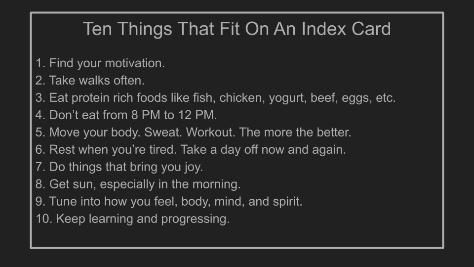

I just read this article called [The Curse of Knowledge](https://mitsloan.mit.edu/ideas-made-to-matter/curse-knowledge-why-experts-struggle-to-explain-their-work) about how experts can be bad at explaining things.  
我刚刚读了这篇文章，叫做《知识的诅咒》，讲述了专家如何不善于解释事情。

The post was published on the MIT Sloan Blog and quoted a senior lecturer in managerial communications.   
该文章发表在麻省理工学院斯隆博客上，并引用了一位管理沟通方面的高级讲师的话。

It began with a strong thesis, which resonated with me, but then devolved into _expertspeak,_ which I found ironic but amusing.  
它以一个强有力的论点开始，引起了我的共鸣，但随后就演变成了专家的讲话，我觉得这很讽刺，但很有趣。

“Understand the process of understanding,” it said.  
"理解的过程，"它说。

Oy.

I see a similar thing in the health and wellness space.  
我在健康和保健领域看到类似的事情。

Experts go deep into the weeds about their subject matter, while obscuring value to a broader audience.  
专家们对他们的主题深入研究，而对更多的人来说，却掩盖了价值。

Whether it’s acronyms most people don’t know, biology few understand, supplement debates, nuanced data or whatever.  
无论是大多数人不知道的首字母缩写词，还是很少有人理解的生物学，补充辩论，细微的数据或其他。

The world is also getting more complicated and so things are harder to understand even without all the big words.  
世界也变得越来越复杂，所以即使没有所有的大词，事情也更难理解。

Complexity is everywhere and it is exhausting.  
复杂性无处不在，令人疲惫不堪。

I am going the other way with this.  
我正在用另一种方式处理这个问题。

I want less. 我想要更少。

Less details but more being.  更少的细节，但更多的存在。

Less routines but more mindset.  例行公事少，但心态多。

Less thinking but more doing. 少思考，多行动。

Less optimization but more fun. 少一些优化，但更多的乐趣。

Less data but more feeling. 数据少，但感觉多。

I run pretty fast and I’m getting faster but I don’t really give a flying finch what my VO2 Max is.  
我跑得相当快，而且速度越来越快，但我真的不关心我的最大氧饱和度是多少。

There, I said it. 在那里，我说了。

I am not that bright. Ask people who know me well and they will attest.  
我没有那么聪明。问问那些熟悉我的人，他们会证明的。

I’ve just been around a while, made a lot of mistakes, and figured out how to filter knowledge.  
我只是在这里呆了一段时间，犯了很多错误，并想出了如何过滤知识。

I don’t need most of the highly specialized information.   
我不需要大多数高度专业化的信息。

It is fascinating and provocative, and I enjoy geeking on it too sometimes, but most of it is incomprehensible and not very useful to anyone except other experts and a very small group of elite athletes.  
它很吸引人，也很有煽动性，我有时也喜欢在上面发呆，但大部分都是不可理解的，除了其他专家和极少数精英运动员，对任何人都没有什么用处。

Instead, I’m keeping it stupid simple.  
相反，我把它保持得很简单。

I want practical educators offering useful information and leading by example.  
我希望实用的教育工作者提供有用的信息并以身作则。

I don’t need theanine or spirulina or whatever.  
我不需要茶氨酸或螺旋藻或其他东西。

I want basics that will allow me to get progressively healthier over time.  
我想要的是能让我随着时间推移逐渐变得更健康的基本条件。

Maybe a handful of guidelines that get me most of the way there and fit on an index card.  
也许有几条准则能让我达到大部分的目标，而且适合放在索引卡上。

One more thing before I get to the index card.   
在我谈到索引卡之前，还有一件事。

I do not often hear experts talking about motivation either.  
我也不经常听到专家谈论动机。

This might be the most important thing, because if we are not motivated, we might not remain dedicated to health over time, especially when things get difficult.  
这可能是最重要的事情，因为如果我们没有动力，我们可能不会长期保持对健康的专注，特别是当事情变得困难时。

Finding our why can be critical.  
找到我们的原因可能是至关重要的。

Why get healthy? Why stay healthy? What is your motivation?  
为什么要获得健康？为什么要保持健康？你的动机是什么？

It’s a thing to give some thought.  
这是一个需要考虑的事情。

I will write more about this before the new year and [have described some of mine at the bottom of this post](https://primecuts.substack.com/p/the-groundhog-day-bias-and-its-remedy).  
我将在新的一年之前写更多关于这个问题的文章，并在这篇文章的底部描述了我的一些情况。

Here are ten things that are pretty straightforward that might help you get incredibly healthy over time. They work for me.  
这里有十件相当直接的事情，可能会帮助你在一段时间内获得令人难以置信的健康。它们对我很有效。

[Share](https://primecuts.substack.com/p/keep-it-stupid-simple?utm_source=substack&utm_medium=email&utm_content=share&action=share&token=eyJ1c2VyX2lkIjo3MjgzNDA4NywicG9zdF9pZCI6ODIxNDUyNzEsImlhdCI6MTY3NjAzNzgxMCwiZXhwIjoxNjc4NjI5ODEwLCJpc3MiOiJwdWItMzkzMDQiLCJzdWIiOiJwb3N0LXJlYWN0aW9uIn0.n-7riGfP36p8VQwW3UMl5yNdpJhlNN4riN4JKPPMSgw)
